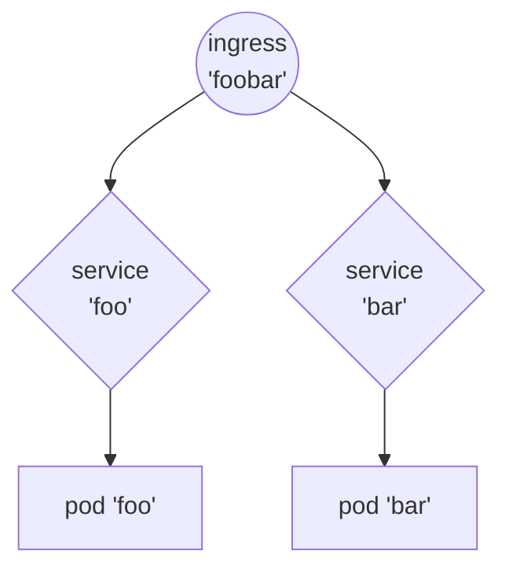

# FluxCD - Démonstration par l'exemple

## Abstract

Sur un cluster Kind 'propre', nous allons mettre en place FluxCD (ie. *'bootstrap'*) et lui faire gérer le déploiement et la mise à jour d'une application très simple que nous avons déjà utilisée pour tester le bon fonctionnement de notre Ingress controller Nginx lorsque nous avons installé notre cluster Kind en local.

!!! note
    https://kind.sigs.k8s.io/docs/user/ingress/#ingress-nginx

Plusieurs étapes viendront jalonner notre chemin jusqu'à l'automatisation complète du déploiement de notre application avec FluxCD :
* *bootstrapping* de FluxCD sur notre cluster;
* ...
* ...


-- schéma --
GitHub


## Pré-requis


### Préparation de notre environnement de travail en local

Nous avons déjà suivi les howtos suivant pour préparer notre environnement de travail sur notre laptop avec les CLIs et un cluster Kins opérationnel :

|howto|Link|
|-----|---|
|Command Line Tools|[https://papafrancky.github.io/000_setup/Command_line_tools/](https://papafrancky.github.io/000_setup/Command_line_tools/)|
|Kubernetes en local|[https://papafrancky.github.io/000_setup/Kubernetes_en_local/](https://papafrancky.github.io/000_setup/Kubernetes_en_local/)|


### Création des dépôts GitHub

Commençons par nous identifier sur GitHub et créons deux nouveaux dépôts privés :

|Dépôt|Usage|
|---|---|
|k8s-kind-fluxcd|dépôt GitHub dédié à FluxCD sur notre cluster|
|k8s-kind-apps|dépôt GitHub dédié à l'hébergement des applications à déployer via FluxCD|


### Clonage des dépôts en local

Une fois les dépôts créés, nous les clonons sur notre laptop :

!!! note
    Nous clonerons tous nos dépôts dans le répertoire renseigné dans la variable __${LOCAL_GITHUB_REPOS}__.

```sh
export LOCAL_GITHUB_REPOS="${HOME}/code/github"

cd ${LOCAL_GITHUB_REPOS}
git clone git@github.com:papafrancky/k8s-kind-fluxcd.git
git clone git@github.com:papafrancky/k8s-kind-apps.git
```


## Bootstrap de FluxCD

Le projet Flux est composé d'un outil en ligne de commande (le FLux CLI) et d'une série de contrôleurs Kubernetes.

Pour installer Flux, vous devez d'abord télécharger le CLI de Flux. Ensuite, à l'aide de la CLI, vous pouvez déployer les contrôleurs Flux sur vos clusters et configurer votre premier pipeline de livraison GitOps.

La commande *'flux bootstrap github'* déploie les contrôleurs Flux sur un cluster Kubernetes et configure ces derniers pour synchroniser l'état du cluster à partir d'un dépôt GitHub. En plus d'installer les contrôleurs, la commande bootstrap pousse les manifestes de Flux vers le dépôt GitHub et configure Flux pour qu'il se mette à jour à partir de Git.

|Doc|Link|
|---|---|
|Install the Flux controllers|https://fluxcd.io/flux/installation/#install-the-flux-controllers|
|Flux bootstrap for GitHub|https://fluxcd.io/flux/installation/bootstrap/github/|
|GitHub default environment variables|https://docs.github.com/en/actions/learn-github-actions/variables#default-environment-variables|


=== "code"

    ```sh
    export GITHUB_USER=papaFrancky
    export GITHUB_TOKEN=<my_github_personal_access_token>
    export FLUXCD_GITHUB_REPO=k8s-kind-fluxcd
    
    flux bootstrap github \
      --token-auth \
      --owner ${GITHUB_USER} \
      --repository ${GITHUB_REPOSITORY} \
      --branch=main \
      --path=. \
      --personal \
      --components-extra=image-reflector-controller,image-automation-controller
    ```

=== "output"

    ```sh
    ► connecting to github.com
    ► cloning branch "main" from Git repository "https://github.com/papaFrancky/k8s-kind-fluxcd.git"
    ✔ cloned repository
    ► generating component manifests
    ✔ generated component manifests
    ✔ component manifests are up to date
    ► installing components in "flux-system" namespace
    ✔ installed components
    ✔ reconciled components
    ► determining if source secret "flux-system/flux-system" exists
    ► generating source secret
    ► applying source secret "flux-system/flux-system"
    ✔ reconciled source secret
    ► generating sync manifests
    ✔ generated sync manifests
    ✔ sync manifests are up to date
    ► applying sync manifests
    ✔ reconciled sync configuration
    ◎ waiting for Kustomization "flux-system/flux-system" to be reconciled
    ✔ Kustomization reconciled successfully
    ► confirming components are healthy
    ✔ helm-controller: deployment ready
    ✔ image-automation-controller: deployment ready
    ✔ image-reflector-controller: deployment ready
    ✔ kustomize-controller: deployment ready
    ✔ notification-controller: deployment ready
    ✔ source-controller: deployment ready
    ✔ all components are healthy
    ```

Vérifions dans les événements de FluxCD :

=== "code"

    ```sh
    flux events
    ```

=== "output"

    ```sh
    LAST SEEN          TYPE    REASON                  OBJECT                          MESSAGE
    15m                     Normal  NewArtifact             GitRepository/flux-system       stored artifact for commit 'Add Flux sync manifests'
    15m                     Normal  ReconciliationSucceeded Kustomization/flux-system       Reconciliation finished in 2.536346081s, next run in 10m0s
    15m                     Normal  Progressing             Kustomization/flux-system       CustomResourceDefinition/alerts.notification.toolkit.fluxcd.io configured
                                                                                            CustomResourceDefinition/buckets.source.toolkit.fluxcd.io configured
                                                                                            CustomResourceDefinition/gitrepositories.source.toolkit.fluxcd.io configured
                                                                                            CustomResourceDefinition/helmcharts.source.toolkit.fluxcd.io configured
                                                                                            CustomResourceDefinition/helmreleases.helm.toolkit.fluxcd.io configured
                                                                                            CustomResourceDefinition/helmrepositories.source.toolkit.fluxcd.io configured
                                                                                            CustomResourceDefinition/imagepolicies.image.toolkit.fluxcd.io configured
                                                                                            CustomResourceDefinition/imagerepositories.image.toolkit.fluxcd.io configured
                                                                                            CustomResourceDefinition/imageupdateautomations.image.toolkit.fluxcd.io configured
                                                                                            CustomResourceDefinition/kustomizations.kustomize.toolkit.fluxcd.io configured
                                                                                            CustomResourceDefinition/ocirepositories.source.toolkit.fluxcd.io configured
                                                                                            CustomResourceDefinition/providers.notification.toolkit.fluxcd.io configured
                                                                                            CustomResourceDefinition/receivers.notification.toolkit.fluxcd.io configured
                                                                                            Namespace/flux-system configured
                                                                                            ServiceAccount/flux-system/helm-controller configured
                                                                                            ServiceAccount/flux-system/image-automation-controller configured
                                                                                            ServiceAccount/flux-system/image-reflector-controller configured
                                                                                            ServiceAccount/flux-system/kustomize-controller configured
                                                                                            ServiceAccount/flux-system/notification-controller configured
                                                                                            ServiceAccount/flux-system/source-controller configured
                                                                                            ClusterRole/crd-controller-flux-system configured
                                                                                            ClusterRole/flux-edit-flux-system configured
                                                                                            ClusterRole/flux-view-flux-system configured
                                                                                            ClusterRoleBinding/cluster-reconciler-flux-system configured
                                                                                            ClusterRoleBinding/crd-controller-flux-system configured
                                                                                            Service/flux-system/notification-controller configured
                                                                                            Service/flux-system/source-controller configured
                                                                                            Service/flux-system/webhook-receiver configured
                                                                                            Deployment/flux-system/helm-controller configured
                                                                                            Deployment/flux-system/image-automation-controller configured
                                                                                            Deployment/flux-system/image-reflector-controller configured
                                                                                            Deployment/flux-system/kustomize-controller configured
                                                                                            Deployment/flux-system/notification-controller configured
                                                                                            Deployment/flux-system/source-controller configured
                                                                                            Kustomization/flux-system/flux-system configured
                                                                                            NetworkPolicy/flux-system/allow-egress configured
                                                                                            NetworkPolicy/flux-system/allow-scraping configured
                                                                                            NetworkPolicy/flux-system/allow-webhooks configured
                                                                                            GitRepository/flux-system/flux-system configured
    5m29s                   Normal  ReconciliationSucceeded Kustomization/flux-system       Reconciliation finished in 761.801712ms, next run in 10m0s
    22s (x15 over 14m)      Normal  GitOperationSucceeded   GitRepository/flux-system       no changes since last reconcilation: observed revision 'main@sha1:1258fc09abf6cd1bd639cd18ce4a2e9e4c1a7a9b'
    ```


Cherchons les objets créés dans le namespace de FluxCD :

=== "code"

    ```sh
    kubectl -n flux-system get all
    ```

=== "output"

    ```sh
    NAME                                               READY   STATUS    RESTARTS   AGE
    pod/helm-controller-57694fc9d6-pbl5c               1/1     Running   0          19m
    pod/image-automation-controller-5f7d999559-49fms   1/1     Running   0          19m
    pod/image-reflector-controller-58db7c9785-mjfh5    1/1     Running   0          19m
    pod/kustomize-controller-7f689848b9-k7hmd          1/1     Running   0          19m
    pod/notification-controller-6cffcffd7d-rkmwl       1/1     Running   0          19m
    pod/source-controller-7f95c446b6-b8gcd             1/1     Running   0          19m
    
    NAME                              TYPE        CLUSTER-IP     EXTERNAL-IP   PORT(S)   AGE
    service/notification-controller   ClusterIP   10.96.206.29   <none>        80/TCP    19m
    service/source-controller         ClusterIP   10.96.94.126   <none>        80/TCP    19m
    service/webhook-receiver          ClusterIP   10.96.125.18   <none>        80/TCP    19m
    
    NAME                                          READY   UP-TO-DATE   AVAILABLE   AGE
    deployment.apps/helm-controller               1/1     1            1           19m
    deployment.apps/image-automation-controller   1/1     1            1           19m
    deployment.apps/image-reflector-controller    1/1     1            1           19m
    deployment.apps/kustomize-controller          1/1     1            1           19m
    deployment.apps/notification-controller       1/1     1            1           19m
    deployment.apps/source-controller             1/1     1            1           19m
    
    NAME                                                     DESIRED   CURRENT   READY   AGE
    replicaset.apps/helm-controller-57694fc9d6               1         1         1       19m
    replicaset.apps/image-automation-controller-5f7d999559   1         1         1       19m
    replicaset.apps/image-reflector-controller-58db7c9785    1         1         1       19m
    replicaset.apps/kustomize-controller-7f689848b9          1         1         1       19m
    replicaset.apps/notification-controller-6cffcffd7d       1         1         1       19m
    replicaset.apps/source-controller-7f95c446b6             1         1         1       19m
    ```


## Gestion automatique des déploiements d'une application par FluxCD

Nous allons récupérer l'application utilisée dans le *howto* [Kubernetes en local](https://papafrancky.github.io/000_setup/Kubernetes_en_local/) pour étayer notre exemple.
Dans notre cas, l'application de disposant pas de Helm Chart, FluxCD gèrera son déploiement directement depuis un dépôt Git.


### Namespace dédié à l'application

Chaque application sera hébergée dans son propre namespace.

=== "code"
    ```sh
    export LOCAL_GITHUB_REPOS="${HOME}/code/github"
    
    cd ${LOCAL_GITHUB_REPOS}/k8s-kind-fluxcd
    mkdir foobar && cd foobar
    
    kubectl create namespace foobar --dry-run=client -o yaml > namespace.yaml
    kubectl apply -f namespace.yaml

    cat namespace.yaml
    ```

=== "output"
    ```
    apiVersion: v1
    kind: Namespace
    metadata:
      name: k8s-kind-apps
    ```

Poussons les modification sur notre dépôt :

```sh
export LOCAL_GITHUB_REPOS="${HOME}/code/github"
cd ${LOCAL_GITHUB_REPOS}/k8s-kind-fluxcd

git add .
git commit -m "created namespace 'k8s-kind-apps'."
git push
```


### Ajout de l'application *'foobar'* dans GitHub

Nous avons créé sur GitHub un dépôt dédié à l'hébergement des applications que FluxCD va gérer : __k8s-kind-apps__.
Sur notre copie locale, nous allons écrire les manifests qui décrivent l'application *'foobar'*. 



```sh
export LOCAL_GITHUB_REPOS="${HOME}/code/github"

cd ${LOCAL_GITHUB_REPOS}/k8s-kind-apps
mkdir foobar && cd foobar
```

=== "pod: foo" 
    ```sh
    cat << EOF >> foo.pod.yaml
    kind: Pod
    apiVersion: v1
    metadata:
      name: foo-app
      labels:
        app: foo
    spec:
      containers:
      - command:
        - /agnhost
        - netexec
        - --http-port
        - "8080"
        image: registry.k8s.io/e2e-test-images/agnhost:2.39
        name: foo-app
    EOF
    ```

=== "service: foo"
    ```sh
    cat << EOF >> foo.service.yaml
    ---
    kind: Service
    apiVersion: v1
    metadata:
      name: foo-service
    spec:
      selector:
        app: foo
      ports:
      # Default port used by the image
      - port: 8080
    EOF
    ```

=== "pod: bar"
    ```sh
    cat << EOF >> bar.pod.yaml
    ---
    kind: Pod
    apiVersion: v1
    metadata:
      name: bar-app
      labels:
        app: bar
    spec:
      containers:
      - command:
        - /agnhost
        - netexec
        - --http-port
        - "8080"
        image: registry.k8s.io/e2e-test-images/agnhost:2.39
        name: bar-app
    EOF
    ```

=== "service: bar"
    ```sh
    cat << EOF >> bar.service.yaml
    ---
    kind: Service
    apiVersion: v1
    metadata:
      name: bar-service
    spec:
      selector:
        app: bar
      ports:
      # Default port used by the image
      - port: 8080
    EOF
    ```

=== "ingress: foobar"
    ```sh
    cat << EOF >> foobar.ingress.yaml
    ---
    apiVersion: networking.k8s.io/v1
    kind: Ingress
    metadata:
      name: foobar-ingress
      annotations:
        nginx.ingress.kubernetes.io/rewrite-target: /$2
    spec:
      rules:
      - http:
          paths:
          - pathType: Prefix
            path: /foo(/|$)(.*)
            backend:
              service:
                name: foo-service
                port:
                  number: 8080
          - pathType: Prefix
            path: /bar(/|$)(.*)
            backend:
              service:
                name: bar-service
                port:
                  number: 8080
    EOF
    ```

Nous avons décrit notre application sous la forme de manifests YAML sur notre copie locale du dépôt dédié aux applications :

=== "code"
    ```sh
    export LOCAL_GITHUB_REPOS="${HOME}/code/github"

    tree ${LOCAL_GITHUB_REPOS}/k8s-kind-apps
    ```

=== "output"
    ```sh
    /Users/franck/code/github/k8s-kind-apps
    └── foobar
        ├── bar.pod.yaml
        ├── bar.service.yaml
        ├── foo.pod.yaml
        ├── foo.service.yaml
        └── foobar.ingress.yaml
    ```

Il ne nous reste plus qu'à pousser les modifications sur notre dépôt GitHub :

```sh
export LOCAL_GITHUB_REPOS="${HOME}/code/github"
cd ${LOCAL_GITHUB_REPOS}/k8s-kind-apps

git add .
git commit -m 'feat: added foobar app.'
git push
```

L'application se trouve désormais bien dans le dépôt GitHub dédié aux applications :


### GitRepository *'k8s-kind-fluxcd'*

Nous allons définir au niveau de FluxCD le dépôt GitHub et lui permettre de s'y connecter avec les droits d'écriture.


#### Deploy Keys

Pour permettre à FluxCD de se connecter au dépôt GitHub qui lui est dédié, nous devons créer une paire de clés SSH et déployer la clé publique sur le dépôt.

#### Création des *'Deploy Keys'*

Nous devons créer une paire de clés SSH pour permettre à FluxCD de se connecter avec les droits d'écriture au dépôt dédié à FluxCD. Nous en aurons besoin pour définir le *'GitRepository'*.
S'agissant de 'secrets', nous ne conserverons pas le manifest YAML dans le dépôt.

```sh
export LOCAL_GITHUB_REPOS="${HOME}/code/github"
export GITHUB_USERNAME=papafrancky

cd ${LOCAL_GITHUB_REPOS}/k8s-kind-fluxcd/foobar
flux create secret git k8s-kind-fluxcd \
  --url=ssh://github.com/${GITHUB_USERNAME}/k8s-kind-fluxcd \
  --namespace=foobar
```

Vérifions la bonne création du secret :

=== "code"
    ```sh
    kubectl -n foobar get secret k8s-kind-fluxcd -o yaml
    ```

=== "output"
    ```sh
    apiVersion: v1
    data:
      identity:     LS0tLS1CRUdJTiBQUklWQVRFIEtFWS0tLS0tCk1JRzJBZ0VBTUJBR0J5cUdTTTQ5QWdFR0JTdUJCQUFpQklHZU1JR2JBZ0VCQkRCNDJOSDNTaG1tYndodlNhd3MKZ1l4QnRSc3VBR2pjVzlXa0psSkwyRWdQSE5EK2FXYWFDai9zNFNLUUkxZjhFN21oWkFOaUFBUVhGUmc5WFhGUApIcFdIdTVDS0VhZFNNSjZCL2l6TC9kSHhIeERXS2luN kl1   Z0trRkZnT1BaUGJmbjhmdkhVcmFqVCtYaE9sd0F0Cks2ZDFRM3JVSU9sZXpZNkpIVXBRSFVZNGxCRndWek12NTlQMGJUcE5hbi9NUjZyUkpHaVFhQ3c9Ci0tLS0tRU5EIFBSSVZBVEUgS0VZLS0tLS0K
      identity.pub:     ZWNkc2Etc2hhMi1uaXN0cDM4NCBBQUFBRTJWalpITmhMWE5vWVRJdGJtbHpkSEF6T0RRQUFBQUlibWx6ZEhBek9EUUFBQUJoQkJjVkdEMWRjVThlbFllN2tJb1JwMUl3bm9IK0xNdjkwZkVmRU5ZcUtmb2k2QXFRVVdBNDlrOXQrZngrOGRTdHFOUDVlRTZYQUMwcnAzVkRldFFnNlY3Tmpva2RTbEFkUmppVUVYQlhNeS9uMC9SdE9rMXFmO HhI   cXRFa2FKQm9MQT09Cg==
      known_hosts: Z2l0aHViLmNvbSBlY2RzYS1zaGEyLW5pc3RwMjU2IEFBQUFFMlZqWkhOaExYTm9ZVEl0Ym1semRIQXlOVFlBQUFBSWJtbHpkSEF5TlRZQUFBQkJCRW1LU0VOalFFZXpPbXhrWk15N29wS2d3RkI5bmt0NVlScllNak51RzVOODd1UmdnNkNMcmJvNXdBZFQveTZ2MG1LVjBVMncwV1oyWUIvKytUcG9ja2c9
    kind: Secret
    metadata:
      creationTimestamp: "2024-04-22T19:32:20Z"
      name: k8s-kind-fluxcd
      namespace: foobar
      resourceVersion: "800513"
      uid: e1eec4b8-6673-4d08-afbd-024ffb1333f0
    type: Opaque
    ```

#### Ajout de la clé publique sur le dépôt GitHub

La clé publique peut peut être extraite du secret Kubernetes 'k8s-kind-fluxcd' dans le chemin suivant :
```sh
.data.identity\.pub
```

Plus concrètement :

=== "code"
    ```sh
    kubectl -n foobar get secret k8s-kind-fluxcd -o jsonpath='{.data.identity\.pub}' | base64 -d
    ```

=== "output"
    ```sh
    ecdsa-sha2-nistp384 AAAAE2VjZHNhLXNoYTItbmlzdHAzODQAAAAIbmlzdHAzODQAAABhBBcVGD1dcU8elYe7kIoRp1IwnoH+LMv90fEfENYqKfoi6AqQUWA49k9t+fx+8dStqNP5eE6XAC0rp3VDetQg6V7NjokdSlAdRjiUEXBXMy/n0/RtOk1qf8xHqtEkaJBoLA==
    ```

Nous devons placer cette clé publique sur le dépôt _*k8s-kind-fluxcd*_ : une fois sur la page de dépôt, cliquer sur le bouton _*Settings*_, puis dans la colonne de gauche sur la page suivante, sur le line _*Deploy Keys*_ dans la partie 'Security' :


Pour aider à l'identification de la clé, nous la nommerons 'FluxCD' :


!!! warning
    La case __'Allow write access'__ doit être cochée pour permettre à FluxCD d'apporter des modifications dans son dépôt !


#### Définition du GitRepository *"k8s-kind-apps"*

L'API GitRepository définit une source pour produire un artefact pour une révision d'un dépôt Git.

!!! info
    https://fluxcd.io/flux/components/source/gitrepositories/


* Le GitRepository définit le dépôt GitHub dédié à FluxCD : 
```sh
ssh://git@github.com/${GITHUB_USERNAME}/k8s-kind-fluxcd.git.
```
* Pour y accéder il faudra utiliser la __clé SSH__ contenue dans le secret portant le même nom que le dépôt en question.
* La branche Git qui nous intéresse est la branche 'main'.
* Cet objet sera rattaché au namespace de l'application 'foobar'


```sh 
   export LOCAL_GITHUB_REPOS="${HOME}/code/github"
   export GITHUB_USERNAME=papafrancky

   cd ${LOCAL_GITHUB_REPOS}/k8s-kind-fluxcd/foobar
```

=== "code"
    ```sh
    flux create source git k8s-kind-fluxcd \
      --url=ssh://git@github.com/${GITHUB_USERNAME}/k8s-kind-fluxcd.git \
      --branch=main \
      --secret-ref=k8s-kind-fluxcd \
      --namespace=foobar \
      --export > gitrepository.yaml
    
    cat ${LOCAL_GITHUB_REPOS}/k8s-kind-fluxcd/foobar/gitrepository.yaml
    ```
   
=== "output"
    ```sh
    ---
    apiVersion: source.toolkit.fluxcd.io/v1beta2
    kind: GitRepository
    metadata:
      name: k8s-kind-fluxcd
      namespace: foobar
    spec:
      interval: 1m0s
      ref:
        branch: main
      secretRef:
        name: k8s-kind-fluxcd
      url: ssh://git@github.com/papafrancky/k8s-kind-fluxcd.git
    ```


#### Définition de la *'Kustomization'* de l'app 'foobar'

!!! tip
    Nommer le manifest 'kustomize.yml' pose des problèmes, le nom doit être réservé pour les besoins internes de Flux. Nous le nommerons 'sync.yaml'.

=== "code"
    ```sh
    export LOCAL_GITHUB_REPOS="${HOME}/code/github"
    cd ${LOCAL_GITHUB_REPOS}/k8s-kind-fluxcd/foobar
    
    flux create kustomization foobar \
        --source=GitRepository/k8s-kind-apps.foobar \
        --path="./foobar" \
        --prune=true \
        --namespace=foobar \
        --export > sync.yaml

    cat ${LOCAL_GITHUB_REPOS}/k8s-kind-fluxcd/foobar/sync.yaml
    ```

=== "output"

    ```sh
    ---
    apiVersion: kustomize.toolkit.fluxcd.io/v1beta2
    kind: Kustomization
    metadata:
      name: foobar
      namespace: foobar
    spec:
      interval: 1m0s
      path: ./foobar
      prune: true
      sourceRef:
        kind: GitRepository
        name: k8s-kind-apps
        namespace: foobar
    ```


Il est temps de pousser nos modifications dans le dépôt GitHub :

```sh
   export LOCAL_GITHUB_REPOS="${HOME}/code/github"
   cd ${LOCAL_GITHUB_REPOS}/k8s-kind-fluxcd

   git status
   git add .
   git commit -m "feat: added GitRepository and Kustomization for k8s-kind-fluxcd."
   git push
```

Forçons la réconciliation :

=== "code"
    ```sh
    flux reconcile kustomization flux-system --with-source
    ```

=== "output"
    ```sh
    ► annotating GitRepository flux-system in flux-system namespace
    ✔ GitRepository annotated
    ◎ waiting for GitRepository reconciliation
    ✔ fetched revision main@sha1:bdae94f5fed81d4a2846b0fe31857fb1965d44e6
    ► annotating Kustomization flux-system in flux-system namespace
    ✔ Kustomization annotated
    ◎ waiting for Kustomization reconciliation
    ✔ applied revision main@sha1:bdae94f5fed81d4a2846b0fe31857fb1965d44e6
    ```

Nous devrions désormais voir le GitRepository défini au niveau du cluster :

=== "code"
    ```
    kubectl -n foobar get gitrepository k8s-kind-fluxcd 
    ```

=== "output"
    ```
    NAME              URL                                                    AGE     READY   STATUS
    k8s-kind-fluxcd   ssh://git@github.com/papafrancky/k8s-kind-fluxcd.git   7m20s   True    stored artifact for revision 'main@sha1:f54f808fa9ec3d99e4207af8450a147b5034f845'
    ```


### ImageRepository

Notre application _*foobar*_ utilise une image Docker (__e2e-test-images/agnhost__) et nous aimerions qu'elle se mette à jour automatiquement lorsque l'image Docker est mise à jour.
Pour ce faire, nous allons définir un __ImageRepository__ ainsi et y associerons une __ImagePolicy__.

=== "code"
    ```sh
    export LOCAL_GITHUB_REPOS="${HOME}/code/github"
    export GITHUB_USERNAME=papafrancky
    
    cd ${LOCAL_GITHUB_REPOS}/k8s-kind-fluxcd/foobar
    
    flux create image repository foobar \
      --image=registry.k8s.io/e2e-test-images/agnhost \
      --interval=5m \
      --namespace=foobar \
      --export > imagerepository.yaml

    git add imagerepository.yaml
    git commit -m "feat: added image repository for foobar app."
    git push
    ```

=== "manifest"
    ```sh
    ---
    apiVersion: image.toolkit.fluxcd.io/v1beta2
    kind: ImageRepository
    metadata:
      name: foobar
      namespace: foobar
    spec:
      image: registry.k8s.io/e2e-test-images/agnhost
      interval: 5m0s
    ```

Vérifions la bonne création de l'objet :

=== "code"
    ```sh
    kubectl -n foobar get imagerepository foobar -o yaml
    ```

=== "output"
    ```sh
    apiVersion: image.toolkit.fluxcd.io/v1beta2
    kind: ImageRepository
    metadata:
      creationTimestamp: "2024-04-23T18:43:59Z"
      finalizers:
      - finalizers.fluxcd.io
      generation: 1
      labels:
        kustomize.toolkit.fluxcd.io/name: flux-system
        kustomize.toolkit.fluxcd.io/namespace: flux-system
      name: foobar
      namespace: foobar
      resourceVersion: "882404"
      uid: a8a4608e-2bb9-4149-b2d5-2fe5c3ca7a93
    spec:
      exclusionList:
      - ^.*\.sig$
      image: registry.k8s.io/e2e-test-images/agnhost
      interval: 5m0s
      provider: generic
    status:
      canonicalImageName: registry.k8s.io/e2e-test-images/agnhost
      conditions:
      - lastTransitionTime: "2024-04-23T18:44:00Z"
        message: 'successful scan: found 25 tags'
        observedGeneration: 1
        reason: Succeeded
        status: "True"
        type: Ready
      lastScanResult:
        latestTags:
        - "2.9"
        - "2.48"
        - "2.47"
        - "2.45"
        - "2.44"
        - "2.43"
        - "2.41"
        - "2.40"
        - "2.39"
        - "2.38"
        scanTime: "2024-04-23T18:44:00Z"
        tagCount: 25
      observedExclusionList:
      - ^.*\.sig$
      observedGeneration: 1
    ```

Nous pouvons d'ores et déjà constater que nous n'utilisons pas la version la plus récente de l'image __*'e2e-test-images/agnhost'*__ :

* nous utilisons la version __2.39__;
* la version la plus récente est la __2.48__.

=== "code"
    ```sh
    kubectl -n foobar get imagerepository foobar -o jsonpath='{.status.lastScanResult.latestTags}' | jq -r '.'
    ```

=== "output"
    ```sh
    [
      "2.9",
      "2.48",
      "2.47",
      "2.45",
      "2.44",
      "2.43",
      "2.41",
      "2.40",
      "2.39",
      "2.38"
    ]
    ```


### ImagePolicy

Imaginons que nous souhaitions disposer de l'image 2.x la plus récente. Nous pouvons demander à FluxCD de gérer ces mises à jour automatiquement en définissant une __*'ImagePolicy'*__ que nous rattacherons à l'__*'ImageRepository'*__ 'foobar'.

!!! note
    https://github.com/Masterminds/semver#checking-version-constraints

=== "code"
    ```
    export LOCAL_GITHUB_REPOS="${HOME}/code/github"
    export GITHUB_USERNAME=papafrancky
    
    cd ${LOCAL_GITHUB_REPOS}/k8s-kind-fluxcd/foobar
    
    flux create image policy foobar \
      --image-ref=foobar \
      --select-semver='<=2.x' \
      --namespace=foobar \
      --export > imagepolicy.yaml
    
    git add imagepolicy.yaml
    git commit -m "feat: defined an image policy for foobar app."
    git push
    ```

=== "manifest"
    ```
    ---
    apiVersion: image.toolkit.fluxcd.io/v1beta2
    kind: ImagePolicy
    metadata:
      name: foobar
      namespace: foobar
    spec:
      imageRepositoryRef:
        name: foobar
      policy:
        semver:
          range: <=2.x
    ```


### Marquage du manifest de déploiement de l'application 'foobar'

Nous devons maintenant indiquer à FluxCD où mettre la version de l'image à jour dans les manifests de l'application 'foobar'.
En effet, si FluxCD est capable de détecter une nouvelle version de l'image conforme à notre politique de mise à jour (dans notre cas, toutes les versions 2.x), il doit aussi mettre le code de déploiement de l'application.

Dans le cas de notre application 'foobar', l'image Docker et sa version sont précisés dans 2 manifests : 

* ${LOCAL_GITHUB_REPOS}/k8s-kind-apps/foobar/__foo.pod.yaml__;
* ${LOCAL_GITHUB_REPOS}/k8s-kind-apps/foobar/__bar.pod.yaml__.


=== "code"
    ```sh
    export LOCAL_GITHUB_REPOS="${HOME}/code/github"
    export GITHUB_USERNAME=papafrancky
    
    cd ${LOCAL_GITHUB_REPOS}/k8s-kind-apps/foobar
    
    gsed -i 's/agnhost:2\.39/agnhost:2\.39 # {"$imagepolicy": "foobar:foobar"}/' foo.pod.yaml
    gsed -i 's/agnhost:2\.39/agnhost:2\.39 # {"$imagepolicy": "foobar:foobar"}/' bar.pod.yaml
    
    git add .
    git commit -m "feat: added a marker on foobar's pods manifests."
    git push
    ```   

=== "foo.pod.yaml"
    ```sh
    kind: Pod
    apiVersion: v1
    metadata:
      name: foo-app
      labels:
        app: foo
    spec:
      containers:
      - command:
        - /agnhost
        - netexec
        - --http-port
        - "8080"
        image: registry.k8s.io/e2e-test-images/agnhost:2.39 # {"$imagepolicy": "foobar:foobar"}
        name: foo-app
    ```

=== "bar.pod.yaml"
    ```sh
    kind: Pod
    apiVersion: v1
    metadata:
      name: bar-app
      labels:
        app: bar
    spec:
      containers:
      - command:
        - /agnhost
        - netexec
        - --http-port
        - "8080"
        image: registry.k8s.io/e2e-test-images/agnhost:2.39 # {"$imagepolicy": "foobar:foobar"}
        name: bar-app
    ```


### Image Update Automation

