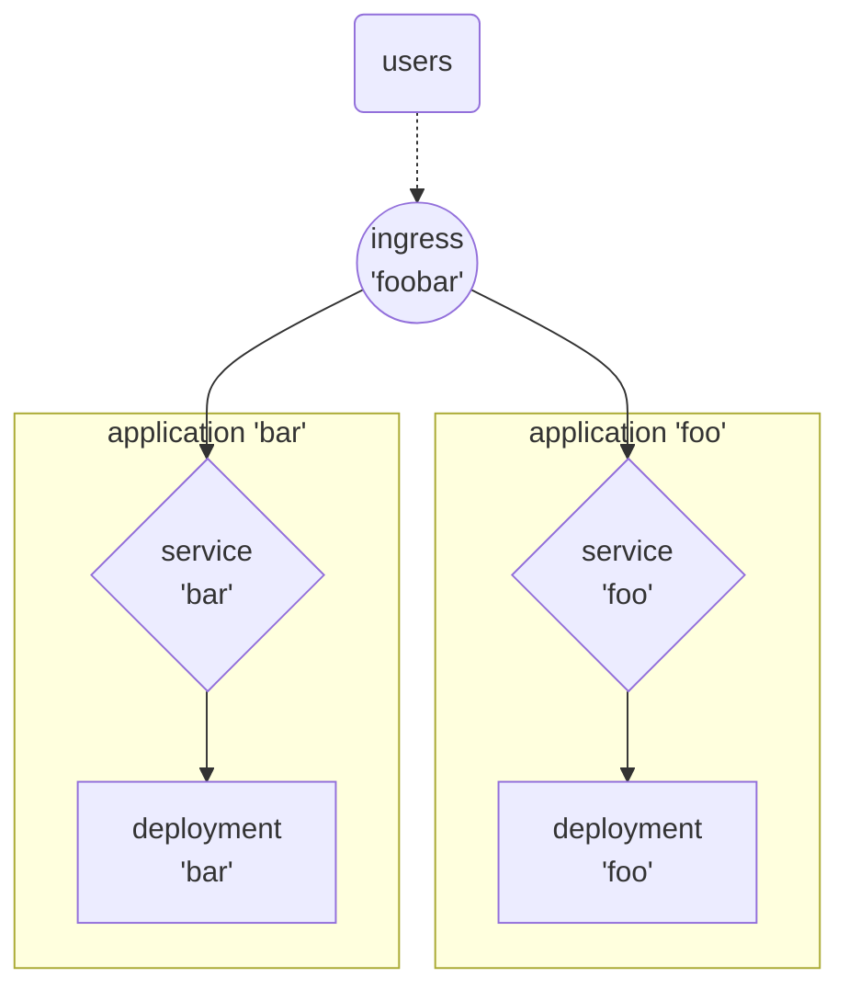

# FluxCD - Démonstration par l'exemple

## Abstract

Sur un cluster Kind 'propre', nous allons mettre en place FluxCD (ie. *'bootstrap'*) et lui faire gérer le déploiement et la mise à jour d'une application très simple que nous avons déjà utilisée pour tester le bon fonctionnement de notre Ingress controller Nginx lorsque nous avons installé notre cluster Kind en local.

!!! note
    https://kind.sigs.k8s.io/docs/user/ingress/#ingress-nginx

Plusieurs étapes viendront jalonner notre chemin jusqu'à l'automatisation complète du déploiement de notre application avec FluxCD :
* *bootstrapping* de FluxCD sur notre cluster;
* ...
* ...


-- schéma --
GitHub


## Pré-requis


### Préparation de notre environnement de travail en local

Nous avons déjà suivi les howtos suivant pour préparer notre environnement de travail sur notre laptop avec les CLIs et un cluster Kins opérationnel :

|howto|Link|
|-----|---|
|Command Line Tools|[https://papafrancky.github.io/000_setup/Command_line_tools/](https://papafrancky.github.io/000_setup/Command_line_tools/)|
|Kubernetes en local|[https://papafrancky.github.io/000_setup/Kubernetes_en_local/](https://papafrancky.github.io/000_setup/Kubernetes_en_local/)|


### Création des dépôts GitHub

Commençons par nous identifier sur GitHub et créons deux nouveaux dépôts privés :

|Dépôt|Usage|
|---|---|
|k8s-kind-fluxcd|dépôt GitHub dédié à FluxCD sur notre cluster|
|k8s-kind-apps|dépôt GitHub dédié à l'hébergement des applications à déployer via FluxCD|


### Clonage des dépôts en local

Une fois les dépôts créés, nous les clonons sur notre laptop :

!!! note
    Nous clonerons tous nos dépôts dans le répertoire renseigné dans la variable __${LOCAL_GITHUB_REPOS}__.

```sh
export LOCAL_GITHUB_REPOS="${HOME}/code/github"

cd ${LOCAL_GITHUB_REPOS}
git clone git@github.com:papafrancky/k8s-kind-fluxcd.git
git clone git@github.com:papafrancky/k8s-kind-apps.git
```


## Bootstrap de FluxCD

Le projet Flux est composé d'un outil en ligne de commande (le FLux CLI) et d'une série de contrôleurs Kubernetes.

Pour installer Flux, vous devez d'abord télécharger le CLI de Flux. Ensuite, à l'aide de la CLI, vous pouvez déployer les contrôleurs Flux sur vos clusters et configurer votre premier pipeline de livraison GitOps.

La commande *'flux bootstrap github'* déploie les contrôleurs Flux sur un cluster Kubernetes et configure ces derniers pour synchroniser l'état du cluster à partir d'un dépôt GitHub. En plus d'installer les contrôleurs, la commande bootstrap pousse les manifestes de Flux vers le dépôt GitHub et configure Flux pour qu'il se mette à jour à partir de Git.

|Doc|Link|
|---|---|
|Install the Flux controllers|https://fluxcd.io/flux/installation/#install-the-flux-controllers|
|Flux bootstrap for GitHub|https://fluxcd.io/flux/installation/bootstrap/github/|
|GitHub default environment variables|https://docs.github.com/en/actions/learn-github-actions/variables#default-environment-variables|


=== "code"

    ```sh
    export GITHUB_USER=papaFrancky
    export GITHUB_TOKEN=<my_github_personal_access_token>
    export FLUXCD_GITHUB_REPO=k8s-kind-fluxcd
    
    flux bootstrap github \
      --token-auth \
      --owner ${GITHUB_USER} \
      --repository ${GITHUB_REPOSITORY} \
      --branch=main \
      --path=. \
      --personal \
      --components-extra=image-reflector-controller,image-automation-controller
    ```

=== "output"

    ```sh
    ► connecting to github.com
    ► cloning branch "main" from Git repository "https://github.com/papaFrancky/k8s-kind-fluxcd.git"
    ✔ cloned repository
    ► generating component manifests
    ✔ generated component manifests
    ✔ component manifests are up to date
    ► installing components in "flux-system" namespace
    ✔ installed components
    ✔ reconciled components
    ► determining if source secret "flux-system/flux-system" exists
    ► generating source secret
    ► applying source secret "flux-system/flux-system"
    ✔ reconciled source secret
    ► generating sync manifests
    ✔ generated sync manifests
    ✔ sync manifests are up to date
    ► applying sync manifests
    ✔ reconciled sync configuration
    ◎ waiting for Kustomization "flux-system/flux-system" to be reconciled
    ✔ Kustomization reconciled successfully
    ► confirming components are healthy
    ✔ helm-controller: deployment ready
    ✔ image-automation-controller: deployment ready
    ✔ image-reflector-controller: deployment ready
    ✔ kustomize-controller: deployment ready
    ✔ notification-controller: deployment ready
    ✔ source-controller: deployment ready
    ✔ all components are healthy
    ```

Vérifions dans les événements de FluxCD :

=== "code"

    ```sh
    flux events
    ```

=== "output"

    ```sh
    LAST SEEN          TYPE    REASON                  OBJECT                          MESSAGE
    15m                     Normal  NewArtifact             GitRepository/flux-system       stored artifact for commit 'Add Flux sync manifests'
    15m                     Normal  ReconciliationSucceeded Kustomization/flux-system       Reconciliation finished in 2.536346081s, next run in 10m0s
    15m                     Normal  Progressing             Kustomization/flux-system       CustomResourceDefinition/alerts.notification.toolkit.fluxcd.io configured
                                                                                            CustomResourceDefinition/buckets.source.toolkit.fluxcd.io configured
                                                                                            CustomResourceDefinition/gitrepositories.source.toolkit.fluxcd.io configured
                                                                                            CustomResourceDefinition/helmcharts.source.toolkit.fluxcd.io configured
                                                                                            CustomResourceDefinition/helmreleases.helm.toolkit.fluxcd.io configured
                                                                                            CustomResourceDefinition/helmrepositories.source.toolkit.fluxcd.io configured
                                                                                            CustomResourceDefinition/imagepolicies.image.toolkit.fluxcd.io configured
                                                                                            CustomResourceDefinition/imagerepositories.image.toolkit.fluxcd.io configured
                                                                                            CustomResourceDefinition/imageupdateautomations.image.toolkit.fluxcd.io configured
                                                                                            CustomResourceDefinition/kustomizations.kustomize.toolkit.fluxcd.io configured
                                                                                            CustomResourceDefinition/ocirepositories.source.toolkit.fluxcd.io configured
                                                                                            CustomResourceDefinition/providers.notification.toolkit.fluxcd.io configured
                                                                                            CustomResourceDefinition/receivers.notification.toolkit.fluxcd.io configured
                                                                                            Namespace/flux-system configured
                                                                                            ServiceAccount/flux-system/helm-controller configured
                                                                                            ServiceAccount/flux-system/image-automation-controller configured
                                                                                            ServiceAccount/flux-system/image-reflector-controller configured
                                                                                            ServiceAccount/flux-system/kustomize-controller configured
                                                                                            ServiceAccount/flux-system/notification-controller configured
                                                                                            ServiceAccount/flux-system/source-controller configured
                                                                                            ClusterRole/crd-controller-flux-system configured
                                                                                            ClusterRole/flux-edit-flux-system configured
                                                                                            ClusterRole/flux-view-flux-system configured
                                                                                            ClusterRoleBinding/cluster-reconciler-flux-system configured
                                                                                            ClusterRoleBinding/crd-controller-flux-system configured
                                                                                            Service/flux-system/notification-controller configured
                                                                                            Service/flux-system/source-controller configured
                                                                                            Service/flux-system/webhook-receiver configured
                                                                                            Deployment/flux-system/helm-controller configured
                                                                                            Deployment/flux-system/image-automation-controller configured
                                                                                            Deployment/flux-system/image-reflector-controller configured
                                                                                            Deployment/flux-system/kustomize-controller configured
                                                                                            Deployment/flux-system/notification-controller configured
                                                                                            Deployment/flux-system/source-controller configured
                                                                                            Kustomization/flux-system/flux-system configured
                                                                                            NetworkPolicy/flux-system/allow-egress configured
                                                                                            NetworkPolicy/flux-system/allow-scraping configured
                                                                                            NetworkPolicy/flux-system/allow-webhooks configured
                                                                                            GitRepository/flux-system/flux-system configured
    5m29s                   Normal  ReconciliationSucceeded Kustomization/flux-system       Reconciliation finished in 761.801712ms, next run in 10m0s
    22s (x15 over 14m)      Normal  GitOperationSucceeded   GitRepository/flux-system       no changes since last reconcilation: observed revision 'main@sha1:1258fc09abf6cd1bd639cd18ce4a2e9e4c1a7a9b'
    ```


Cherchons les objets créés dans le namespace de FluxCD :

=== "code"

    ```sh
    kubectl -n flux-system get all
    ```

=== "output"

    ```sh
    NAME                                               READY   STATUS    RESTARTS   AGE
    pod/helm-controller-57694fc9d6-pbl5c               1/1     Running   0          19m
    pod/image-automation-controller-5f7d999559-49fms   1/1     Running   0          19m
    pod/image-reflector-controller-58db7c9785-mjfh5    1/1     Running   0          19m
    pod/kustomize-controller-7f689848b9-k7hmd          1/1     Running   0          19m
    pod/notification-controller-6cffcffd7d-rkmwl       1/1     Running   0          19m
    pod/source-controller-7f95c446b6-b8gcd             1/1     Running   0          19m
    
    NAME                              TYPE        CLUSTER-IP     EXTERNAL-IP   PORT(S)   AGE
    service/notification-controller   ClusterIP   10.96.206.29   <none>        80/TCP    19m
    service/source-controller         ClusterIP   10.96.94.126   <none>        80/TCP    19m
    service/webhook-receiver          ClusterIP   10.96.125.18   <none>        80/TCP    19m
    
    NAME                                          READY   UP-TO-DATE   AVAILABLE   AGE
    deployment.apps/helm-controller               1/1     1            1           19m
    deployment.apps/image-automation-controller   1/1     1            1           19m
    deployment.apps/image-reflector-controller    1/1     1            1           19m
    deployment.apps/kustomize-controller          1/1     1            1           19m
    deployment.apps/notification-controller       1/1     1            1           19m
    deployment.apps/source-controller             1/1     1            1           19m
    
    NAME                                                     DESIRED   CURRENT   READY   AGE
    replicaset.apps/helm-controller-57694fc9d6               1         1         1       19m
    replicaset.apps/image-automation-controller-5f7d999559   1         1         1       19m
    replicaset.apps/image-reflector-controller-58db7c9785    1         1         1       19m
    replicaset.apps/kustomize-controller-7f689848b9          1         1         1       19m
    replicaset.apps/notification-controller-6cffcffd7d       1         1         1       19m
    replicaset.apps/source-controller-7f95c446b6             1         1         1       19m
    ```


## Gestion automatique des déploiements d'applications par FluxCD

FluxCD peut gérer l'automatisation du déploiement d'applications packagées avec Helm ou bien directement depuis un dépôt Git. Nous allons d'abord nous concentrer sur le déploiement d'applications depuis un dépôt Git (GitHub dans notre cas).

Pour illluster le fonctionnement de FluxCD, nous allons déployer 2 applications que nous exposerons par la suite avec notre Ingress Controller Nginx : foo & bar.
En réalité, ces deux applications sont strictement les mêmes, puisqu'elles consistent chacune en un pod utilisant la même image *'e2e-test-images/agnhost'*, mais nous considérerons qu'il s'agit bel et bien de 2 applications distinctes différentes.



Chaque application sera hébergée dans son propre namespace.
Dans le dépôt GitHub dédié aux applications qui seront pilotées par FluxCD, nous créerons un répertoire pour chaque application 'foo' et bar' et y déposerons les manifests YAML qui définiront les services et déploiements pour chacune d'entre elles.

```sh title="${LOCAL_GITHUB_REPOS}/k8s-kins-apps"
k8s-kind-apps
├── bar
│   ├── bar.deployment.yaml
│   ├── bar.service.yaml
│   └── namespace.yaml
└── foo
    ├── foo.deployment.yaml
    ├── foo.service.yaml
    └── namespace.yaml
```


### Namespaces dédiés à l'application

=== "code"
    ```sh
    export LOCAL_GITHUB_REPOS="${HOME}/code/github"
    
    cd ${LOCAL_GITHUB_REPOS}/k8s-kind-fluxcd
    mkdir foo bar
        
    kubectl create namespace foo --dry-run=client -o yaml > foo/namespace.yaml
    kubectl create namespace bar --dry-run=client -o yaml > bar/namespace.yaml
    kubectl apply -f foo/namespace.yaml
    kubectl apply -f bar/namespace.yml
    ```

=== "foo namespace"
    ```sh
    apiVersion: v1
    kind: Namespace
    metadata:
      name: foo
    ```
=== "bar namespace"
    ```sh
    apiVersion: v1
    kind: Namespace
    metadata:
      name: bar
    ```


Poussons les modification sur notre dépôt :

```sh
export LOCAL_GITHUB_REPOS="${HOME}/code/github"
cd ${LOCAL_GITHUB_REPOS}/k8s-kind-fluxcd

git add .
git commit -m "created namespace 'k8s-kind-apps'."
git push
```


### Ajout des applications *'foo'* et *'bar'* dans GitHub

Nous avons créé sur GitHub un dépôt dédié à l'hébergement des applications que FluxCD va gérer : __k8s-kind-apps__.
Sur notre copie locale, nous allons écrire dans un répertoire dédié à chacune des applications les manifests de *'foo'* et de *'bar'* . 


```sh
export LOCAL_GITHUB_REPOS="${HOME}/code/github"

cd ${LOCAL_GITHUB_REPOS}/k8s-kind-apps
mkdir foo bar

```

=== "deployment: foo" 
    ```sh
    cat << EOF >> foo/deployment.yaml
    apiVersion: apps/v1
    kind: Deployment
    metadata:
      labels:
        app: foo
      name: foo
    spec:
      replicas: 1
      selector:
        matchLabels:
          app: foo
      template:
        metadata:
          labels:
            app: foo
        spec:
          containers:
          - name: agnhost
            image: registry.k8s.io/e2e-test-images/agnhost:2.39
            command:
            - /agnhost
            - netexec
            - --http-port
            - "8080"
    EOF
    ```

=== "service: foo"
    ```sh
    cat << EOF >> foo/service.yaml
    ---
    kind: Service
    apiVersion: v1
    metadata:
      name: foo
    spec:
      selector:
        app: foo
      ports:
      # Default port used by the image
      - port: 8080
        EOF
    ```

=== "deployment: bar"
    ```sh
    cat << EOF >> bar/deployment.yaml
    apiVersion: apps/v1
    kind: Deployment
    metadata:
      labels:
        app: bar
      name: bar
    spec:
      replicas: 1
      selector:
        matchLabels:
          app: bar
      template:
        metadata:
          labels:
            app: bar
        spec:
          containers:
          - name: agnhost
            image: registry.k8s.io/e2e-test-images/agnhost:2.39
            command:
            - /agnhost
            - netexec
            - --http-port
            - "8080"
    EOF
    ```

=== "service: bar"
    ```sh
    cat << EOF >> bar/service.yaml
     ---
    kind: Service
    apiVersion: v1
    metadata:
      name: bar
    spec:
      selector:
        app: bar
      ports:
      # Default port used by the image
      - port: 8080
        EOF
    ```


Nous avons décrit nos applications sous la forme de manifests YAML sur notre copie locale du dépôt dédié aux applications :

=== "code"
    ```sh
    export LOCAL_GITHUB_REPOS="${HOME}/code/github"

    tree ${LOCAL_GITHUB_REPOS}/k8s-kind-apps
    ```

=== "output"
    ```sh
    ${LOCAL_GITHUB_REPOS}/k8s-kind-apps
    ├── bar
    │   ├── deployment.yaml
    │   ├── namespace.yaml
    │   └── service.yaml
    └── foo
        ├── deployment.yaml
        ├── namespace.yaml
        └── service.yaml
    ```

Il ne nous reste plus qu'à pousser les modifications sur notre dépôt GitHub :

```sh
export LOCAL_GITHUB_REPOS="${HOME}/code/github"
cd ${LOCAL_GITHUB_REPOS}/k8s-kind-apps

git add .
git commit -m 'feat: added foobar app.'
git push
```

Les applications se trouvent désormais bien dans le dépôt GitHub dédié aux applications :


### Exposition des applications

L'exposition des applications hébergées sur le cluster doit être gérée en dehors des applications. Nous allons définir les règles de routage de notre Ingress controller Nginx dans le dépôt GitHub dédié à FluxCD :


=== "ingress"
    ```sh
    export LOCAL_GITHUB_REPOS="${HOME}/code/github"
    
    cat << EOF >> ${LOCAL_GITHUB_REPOS}/k8s-kind-fluxcd/exposition/ingress.yaml
    ---
    apiVersion: networking.k8s.io/v1
    kind: Ingress
    metadata:
      name: nginx-ingress
      namespace: ingress-nginx
      annotations:
        nginx.ingress.kubernetes.io/rewrite-target: /$2
    spec:
      rules:
      - http:
          paths:
          - pathType: Prefix
            path: /foo(/|$)(.*)
            backend:
              service:
                name: foo
                port:
                  number: 8080
          - pathType: Prefix
            path: /bar(/|$)(.*)
            backend:
              service:
                name: bar
                port:
                  number: 8080
    EOF
    ```

Poussons les modifications sur le dépôt central :

```sh
export LOCAL_GITHUB_REPOS="${HOME}/code/github"
cd ${LOCAL_GITHUB_REPOS}/k8s-kind-fluxcd

git add exposition
git commit -m 'feat: defined ingress routes.'
git push
```


### GitRepository *'k8s-kind-fluxcd'*

Nous allons définir au niveau de FluxCD le dépôt GitHub et lui permettre de s'y connecter avec les droits d'écriture.


#### Deploy Keys

Pour permettre à FluxCD de se connecter au dépôt GitHub qui lui est dédié, nous devons créer une paire de clés SSH et déployer la clé publique sur le dépôt.

#### Création des *'Deploy Keys'*

Nous devons créer une paire de clés SSH pour permettre à FluxCD de se connecter avec les droits d'écriture au dépôt dédié à FluxCD. Nous en aurons besoin pour définir le *'GitRepository'*.
S'agissant de 'secrets', nous ne conserverons pas le manifest YAML dans le dépôt.

```sh
flux create secret git k8s-kind-fluxcd \
  --url=ssh://github.com/${GITHUB_USERNAME}/k8s-kind-fluxcd \
  --namespace=foo
flux create secret git k8s-kind-fluxcd \
  --url=ssh://github.com/${GITHUB_USERNAME}/k8s-kind-fluxcd \
  --namespace=bar
```

Vérifions la bonne création du secret :

=== "code"
    ```sh
    kubectl -n foo get secret k8s-kind-fluxcd -o yaml
    kubectl -n bar get secret k8s-kind-fluxcd -o yaml
    ```

=== "foo secret"
    ```sh
    apiVersion: v1
    data:
      identity:     LS0tLS1CRUdJTiBQUklWQVRFIEtFWS0tLS0tCk1JRzJBZ0VBTUJBR0J5cUdTTTQ5QWdFR0JTdUJCQUFpQklHZU1JR2JBZ0VCQkRBcVd6Y1pQZUwrLys3RWJ5NHQKN1dKMmdvZjUvOWNmS1VmVmxrVHFZMzZnQTl2N2NYbDFRN0RHMHBKR3Y4Q1hER0doWkFOaUFBUllnemlJWWxragpIUnRROVV6dDB3c3o5eHJ2aWtYYzFhWm5jelBnMnpUelA1    a1pGS2ZqNVRSb1U3Tmt0Y3h6MS8zRjM5MWFid1VyCmRBeXZ6bkZHeEd2eG1INXJBNmtLUTI5MFpENGJnb1BzeEphTU9aWHBwckRncm5mdTNFZmw4Z2s9Ci0tLS0tRU5EIFBSSVZBVEUgS0VZLS0tLS0K
      identity.pub:     ZWNkc2Etc2hhMi1uaXN0cDM4NCBBQUFBRTJWalpITmhMWE5vWVRJdGJtbHpkSEF6T0RRQUFBQUlibWx6ZEhBek9EUUFBQUJoQkZpRE9JaGlXU01kRzFEMVRPM1RDelAzR3UrS1JkelZwbWR6TStEYk5QTS9tUmtVcCtQbE5HaFRzMlMxekhQWC9jWGYzVnB2QlN0MERLL09jVWJFYS9HWWZtc0RxUXBEYjNSa1BodUNnK3pFbG93NWxlbW1zT0N1    ZCs3Y1IrWHlDUT09Cg==
      known_hosts: Z2l0aHViLmNvbSBlY2RzYS1zaGEyLW5pc3RwMjU2IEFBQUFFMlZqWkhOaExYTm9ZVEl0Ym1semRIQXlOVFlBQUFBSWJtbHpkSEF5TlRZQUFBQkJCRW1LU0VOalFFZXpPbXhrWk15N29wS2d3RkI5bmt0NVlScllNak51RzVOODd1UmdnNkNMcmJvNXdBZFQveTZ2MG1LVjBVMncwV1oyWUIvKytUcG9ja2c9
    kind: Secret
    metadata:
      creationTimestamp: "2024-04-24T16:56:47Z"
      name: k8s-kind-fluxcd
      namespace: foo
      resourceVersion: "1027167"
      uid: e01fd494-515c-4496-b189-568af395975d
    type: Opaque
    ```

=== "bar secret"
    ```sh
    apiVersion: v1
    data:
      identity:     LS0tLS1CRUdJTiBQUklWQVRFIEtFWS0tLS0tCk1JRzJBZ0VBTUJBR0J5cUdTTTQ5QWdFR0JTdUJCQUFpQklHZU1JR2JBZ0VCQkRBK29WdkpmT1V5QWpDcVJjbDYKMG1MZjE4NjNxLy9JZTNBdzBpL2w2eFRXcjhJWERXRVB5ZkxIYWJmdWg2MHQyK21oWkFOaUFBU05hcm1PWE9YTQpidHVaM0c0YmtiZHBlSjVyY28zS2ZSTWFrL1pFTDY5UVl    qSTIvdXdKbGRMTkt3d2VjUVl0UFFxSzB5Zlg1QTNoCkpiZVdZM1JVUWhVMFJhcktWaGJ3bURGOWNwRnRNR0g4c1JFRTQ3QS9GbkxRbVc0VW04UUhTYlE9Ci0tLS0tRU5EIFBSSVZBVEUgS0VZLS0tLS0K
      identity.pub:     ZWNkc2Etc2hhMi1uaXN0cDM4NCBBQUFBRTJWalpITmhMWE5vWVRJdGJtbHpkSEF6T0RRQUFBQUlibWx6ZEhBek9EUUFBQUJoQkkxcXVZNWM1Y3h1MjVuY2JodVJ0Mmw0bm10eWpjcDlFeHFUOWtRdnIxQmlNamIrN0FtVjBzMHJEQjV4QmkwOUNvclRKOWZrRGVFbHQ1WmpkRlJDRlRSRnFzcFdGdkNZTVgxeWtXMHdZZnl4RVFUanNEOFdjdEN    aYmhTYnhBZEp0QT09Cg==
      known_hosts: Z2l0aHViLmNvbSBlY2RzYS1zaGEyLW5pc3RwMjU2IEFBQUFFMlZqWkhOaExYTm9ZVEl0Ym1semRIQXlOVFlBQUFBSWJtbHpkSEF5TlRZQUFBQkJCRW1LU0VOalFFZXpPbXhrWk15N29wS2d3RkI5bmt0NVlScllNak51RzVOODd1UmdnNkNMcmJvNXdBZFQveTZ2MG1LVjBVMncwV1oyWUIvKytUcG9ja2c9
    kind: Secret
    metadata:
      creationTimestamp: "2024-04-24T16:57:07Z"
      name: k8s-kind-fluxcd
      namespace: bar
      resourceVersion: "1027222"
      uid: 889f3be7-833c-4dc6-a8df-1505cd605618
    type: Opaque
    ```


#### Ajout de la clé publique sur le dépôt GitHub

Les clés publiques doivent être extraites des 'secrets' et renseignées dans les paramètres du dépôt GitHub  _*k8s-kind-fluxcd*_.

=== "code"
    ```sh
    kubectl -n foo get secret k8s-kind-fluxcd -o jsonpath='{.data.identity\.pub}' | base64 -d
    kubectl -n bar get secret k8s-kind-fluxcd -o jsonpath='{.data.identity\.pub}' | base64 -d
    ```

=== "foo public key"
    '''sh
    ecdsa-sha2-nistp384 AAAAE2VjZHNhLXNoYTItbmlzdHAzODQAAAAIbmlzdHAzODQAAABhBFiDOIhiWSMdG1D1TO3TCzP3Gu+KRdzVpmdzM+DbNPM/mRkUp+PlNGhTs2S1zHPX/cXf3VpvBSt0DK/OcUbEa/GYfmsDqQpDb3RkPhuCg+zElow5lemmsOCud+7cR+XyCQ==
    '''

=== "bar public key"
    '''sh
    ecdsa-sha2-nistp384 AAAAE2VjZHNhLXNoYTItbmlzdHAzODQAAAAIbmlzdHAzODQAAABhBI1quY5c5cxu25ncbhuRt2l4nmtyjcp9ExqT9kQvr1BiMjb+7AmV0s0rDB5xBi09CorTJ9fkDeElt5ZjdFRCFTRFqspWFvCYMX1ykW0wYfyxEQTjsD8WctCZbhSbxAdJtA==
    '''

Une fois sur la page de dépôt, cliquer sur le bouton _*Settings*_, puis dans la colonne de gauche sur la page suivante, sur le line _*Deploy Keys*_ dans la partie 'Security' :


!!! warning
    La case __'Allow write access'__ doit être cochée pour permettre à FluxCD d'apporter des modifications dans son dépôt !


#### Définition du GitRepository *"k8s-kind-apps"*

L'API GitRepository définit une source pour produire un artefact pour une révision d'un dépôt Git.

!!! info
    https://fluxcd.io/flux/components/source/gitrepositories/

Voici les informations qu'il faudra donner pour définir un 'GitRepository' :

* Le nom que nous souhaitons lui donner : *k8s-kind-fluxcd*;
* L'URL du dépôt GitHub : *ssh://git@github.com/${GITHUB_USERNAME}/k8s-kind-fluxcd.git*;
* La branche du dépôt d'où récupérer le code : *main*;
* Le secret d'où extraire la clé privée pour se connecter au dépôt GitHub : *foo* ou *bar* selon l'application concernée.


```sh 
   export LOCAL_GITHUB_REPOS="${HOME}/code/github"
   export GITHUB_USERNAME=papafrancky

   cd ${LOCAL_GITHUB_REPOS}/k8s-kind-fluxcd
   mkdir -p apps/foo apps/bar
```

=== "code"
    ```sh
    flux create source git k8s-kind-fluxcd \
      --url=ssh://git@github.com/${GITHUB_USERNAME}/k8s-kind-fluxcd.git \
      --branch=main \
      --secret-ref=k8s-kind-fluxcd \
      --namespace=foo \
      --export > apps/foo/gitrepository.yaml
    
    flux create source git k8s-kind-fluxcd \
      --url=ssh://git@github.com/${GITHUB_USERNAME}/k8s-kind-fluxcd.git \
      --branch=main \
      --secret-ref=k8s-kind-fluxcd \
      --namespace=bar \
      --export > apps/bar/gitrepository.yaml
    ```
   
=== "'foo' GitRepository"
    ```sh
    ---
    apiVersion: source.toolkit.fluxcd.io/v1beta2
    kind: GitRepository
    metadata:
      name: k8s-kind-fluxcd
      namespace: foo
    spec:
      interval: 1m0s
      ref:
        branch: main
      secretRef:
        name: k8s-kind-fluxcd
      url: ssh://git@github.com/papafrancky/k8s-kind-fluxcd.git
    ```

=== "'bar' GitRepository"
    ```
    ---
    apiVersion: source.toolkit.fluxcd.io/v1beta2
    kind: GitRepository
    metadata:
      name: k8s-kind-fluxcd
      namespace: bar
    spec:
      interval: 1m0s
      ref:
        branch: main
      secretRef:
        name: k8s-kind-fluxcd
      url: ssh://git@github.com/papafrancky/k8s-kind-fluxcd.git
    ```


#### Définition des *'Kustomizations'*

!!! tip
    Nommer le manifest 'kustomize.yml' pose des problèmes, le nom doit être réservé pour les besoins internes de Flux. Nous le nommerons 'sync.yaml'.

=== "code"
    ```sh
    export LOCAL_GITHUB_REPOS="${HOME}/code/github"
    cd ${LOCAL_GITHUB_REPOS}/k8s-kind-fluxcd
    
    flux create kustomization foo \
        --source=GitRepository/k8s-kind-apps.foo \
        --path="./foo" \
        --prune=true \
        --namespace=foo \
        --export > apps/foo/sync.yaml

    flux create kustomization bar \
        --source=GitRepository/k8s-kind-apps.bar \
        --path="./bar" \
        --prune=true \
        --namespace=bar \
        --export > apps/bar/sync.yaml
    ```

=== "'foo' kustomization"
    ```sh
    ---
    apiVersion: kustomize.toolkit.fluxcd.io/v1beta2
    kind: Kustomization
    metadata:
      name: foo
      namespace: foo
    spec:
      interval: 1m0s
      path: ./apps/foo
      prune: true
      sourceRef:
        kind: GitRepository
        name: k8s-kind-apps
        namespace: foo
    ```

=== "'bar' kustomization"
    ```sh
    ---
    apiVersion: kustomize.toolkit.fluxcd.io/v1beta2
    kind: Kustomization
    metadata:
      name: bar
      namespace: bar
    spec:
      interval: 1m0s
      path: ./apps/bar
      prune: true
      sourceRef:
        kind: GitRepository
        name: k8s-kind-apps
        namespace: bar
    ```


Il est temps de pousser nos modifications dans le dépôt GitHub :

```sh
   export LOCAL_GITHUB_REPOS="${HOME}/code/github"
   cd ${LOCAL_GITHUB_REPOS}/k8s-kind-fluxcd

   git status
   git add .
   git commit -m "feat: added GitRepositories and Kustomizations for 'foo' and 'bar' apps."
   git push
```

Forçons la réconciliation :

=== "code"
    ```sh
    flux reconcile kustomization flux-system --with-source
    ```

=== "output"
    ```sh
    ► annotating GitRepository flux-system in flux-system namespace
    ✔ GitRepository annotated
    ◎ waiting for GitRepository reconciliation
    ✔ fetched revision main@sha1:c4b0b431e0b2d382a9278ecb56698212f46e10fe
    ► annotating Kustomization flux-system in flux-system namespace
    ✔ Kustomization annotated
    ◎ waiting for Kustomization reconciliation
    ✔ applied revision main@sha1:c4b0b431e0b2d382a9278ecb56698212f46e10fe
    ```

Nous devrions désormais voir le GitRepository défini au niveau du cluster :

=== "code"
    ```
    k -n foo get gitrepository k8s-kind-fluxcd
    k -n bar get gitrepository k8s-kind-fluxcd
    ```

=== "output "
    ```
    NAME              URL                                                    AGE   READY   STATUS
    k8s-kind-fluxcd   ssh://git@github.com/papafrancky/k8s-kind-fluxcd.git   19m   True    stored artifact for revision 'main@sha1:755c207ac8a2e883a08aedd1c57fbe7004d1c801'
    
    NAME              URL                                                    AGE   READY   STATUS
    k8s-kind-fluxcd   ssh://git@github.com/papafrancky/k8s-kind-fluxcd.git   19m   True    stored artifact for revision 'main@sha1:755c207ac8a2e883a08aedd1c57fbe7004d1c801'
    ```


### ImageRepository

Nos deux applications _*foo*_ et _*bar*_ utilisent une même image Docker ("__e2e-test-images/agnhost__") et nous aimerions qu'elle soit mise à jour automatiquement si une nouvelle version venait à être publiée.
La mise en place d'un tel process d'automatisation nécessite la définition préalable d'un __'ImageRepository'__ auquel nous associerons une __'ImagePolicy'__.

=== "code"
    ```sh
    export LOCAL_GITHUB_REPOS="${HOME}/code/github"
    export GITHUB_USERNAME=papafrancky
    
    cd ${LOCAL_GITHUB_REPOS}/k8s-kind-fluxcd
    
    flux create image repository foo \
      --image=registry.k8s.io/e2e-test-images/agnhost \
      --interval=5m \
      --namespace=foo \
      --export > apps/foo/imagerepository.yaml

    flux create image repository bar \
      --image=registry.k8s.io/e2e-test-images/agnhost \
      --interval=5m \
      --namespace=bar \
      --export > apps/bar/imagerepository.yaml

    git add .
    git commit -m "feat: added image repository for foo and bar apps."
    git push
    ```

=== "'foo' ImagePolicy"
    ```sh
    ---
    apiVersion: image.toolkit.fluxcd.io/v1beta2
    kind: ImageRepository
    metadata:
      name: foo
      namespace: foo
    spec:
      image: registry.k8s.io/e2e-test-images/agnhost
      interval: 5m0s
    ```

=== "'bar' ImagePolicy"
    ```sh
    ---
    apiVersion: image.toolkit.fluxcd.io/v1beta2
    kind: ImageRepository
    metadata:
      name: bar
      namespace: bar
    spec:
      image: registry.k8s.io/e2e-test-images/agnhost
      interval: 5m0s
    ```

Vérifions la bonne création des *'ImagePolicies'*:

=== "code"
    ```sh
    kubectl -n foo get imagerepository foobar -o yaml
    kubectl -n bar get imagerepository foobar -o yaml
    ```

=== "output"
    ```sh
    apiVersion: image.toolkit.fluxcd.io/v1beta2
    kind: ImageRepository
    metadata:
      creationTimestamp: "2024-04-23T18:43:59Z"
      finalizers:
      - finalizers.fluxcd.io
      generation: 1
      labels:
        kustomize.toolkit.fluxcd.io/name: flux-system
        kustomize.toolkit.fluxcd.io/namespace: flux-system
      name: foobar
      namespace: foobar
      resourceVersion: "882404"
      uid: a8a4608e-2bb9-4149-b2d5-2fe5c3ca7a93
    spec:
      exclusionList:
      - ^.*\.sig$
      image: registry.k8s.io/e2e-test-images/agnhost
      interval: 5m0s
      provider: generic
    status:
      canonicalImageName: registry.k8s.io/e2e-test-images/agnhost
      conditions:
      - lastTransitionTime: "2024-04-23T18:44:00Z"
        message: 'successful scan: found 25 tags'
        observedGeneration: 1
        reason: Succeeded
        status: "True"
        type: Ready
      lastScanResult:
        latestTags:
        - "2.9"
        - "2.48"
        - "2.47"
        - "2.45"
        - "2.44"
        - "2.43"
        - "2.41"
        - "2.40"
        - "2.39"
        - "2.38"
        scanTime: "2024-04-23T18:44:00Z"
        tagCount: 25
      observedExclusionList:
      - ^.*\.sig$
      observedGeneration: 1
    ```

Nous pouvons d'ores et déjà constater que nous n'utilisons pas la version la plus récente de l'image __*'e2e-test-images/agnhost'*__ :

* nous utilisons la version __2.39__;
* la version la plus récente est la __2.48__.

=== "code"
    ```sh
    kubectl -n foobar get imagerepository foobar -o jsonpath='{.status.lastScanResult.latestTags}' | jq -r '.'
    ```

=== "output"
    ```sh
    [
      "2.9",
      "2.48",
      "2.47",
      "2.45",
      "2.44",
      "2.43",
      "2.41",
      "2.40",
      "2.39",
      "2.38"
    ]
    ```


### ImagePolicy

Imaginons que nous souhaitions disposer de l'image 2.x la plus récente. Nous pouvons demander à FluxCD de gérer ces mises à jour automatiquement en définissant une __*'ImagePolicy'*__ que nous rattacherons à l'__*'ImageRepository'*__ 'foobar'.

!!! note
    https://github.com/Masterminds/semver#checking-version-constraints

=== "code"
    ```
    export LOCAL_GITHUB_REPOS="${HOME}/code/github"
    export GITHUB_USERNAME=papafrancky
    
    cd ${LOCAL_GITHUB_REPOS}/k8s-kind-fluxcd/foobar
    
    flux create image policy foobar \
      --image-ref=foobar \
      --select-semver='<=2.x' \
      --namespace=foobar \
      --export > imagepolicy.yaml
    
    git add imagepolicy.yaml
    git commit -m "feat: defined an image policy for foobar app."
    git push
    ```

=== "manifest"
    ```
    ---
    apiVersion: image.toolkit.fluxcd.io/v1beta2
    kind: ImagePolicy
    metadata:
      name: foobar
      namespace: foobar
    spec:
      imageRepositoryRef:
        name: foobar
      policy:
        semver:
          range: <=2.x
    ```


### Marquage du manifest de déploiement de l'application 'foobar'

Nous devons maintenant indiquer à FluxCD où mettre la version de l'image à jour dans les manifests de l'application 'foobar'.
En effet, si FluxCD est capable de détecter une nouvelle version de l'image conforme à notre politique de mise à jour (dans notre cas, toutes les versions 2.x), il doit aussi mettre le code de déploiement de l'application.

Dans le cas de notre application 'foobar', l'image Docker et sa version sont précisés dans 2 manifests : 

* ${LOCAL_GITHUB_REPOS}/k8s-kind-apps/foobar/__foo.pod.yaml__;
* ${LOCAL_GITHUB_REPOS}/k8s-kind-apps/foobar/__bar.pod.yaml__.


=== "code"
    ```sh
    export LOCAL_GITHUB_REPOS="${HOME}/code/github"
    export GITHUB_USERNAME=papafrancky
    
    cd ${LOCAL_GITHUB_REPOS}/k8s-kind-apps/foobar
    
    gsed -i 's/agnhost:2\.39/agnhost:2\.39 # {"$imagepolicy": "foobar:foobar"}/' foo.pod.yaml
    gsed -i 's/agnhost:2\.39/agnhost:2\.39 # {"$imagepolicy": "foobar:foobar"}/' bar.pod.yaml
    
    git add .
    git commit -m "feat: added a marker on foobar's pods manifests."
    git push
    ```   

!!! note
    "foobar.foobar" correspond à "<namespace>.<imagepolicy>"

=== "foo.pod.yaml"
    ```sh
    kind: Pod
    apiVersion: v1
    metadata:
      name: foo-app
      labels:
        app: foo
    spec:
      containers:
      - command:
        - /agnhost
        - netexec
        - --http-port
        - "8080"
        image: registry.k8s.io/e2e-test-images/agnhost:2.39 # {"$imagepolicy": "foobar:foobar"}
        name: foo-app
    ```

=== "bar.pod.yaml"
    ```sh
    kind: Pod
    apiVersion: v1
    metadata:
      name: bar-app
      labels:
        app: bar
    spec:
      containers:
      - command:
        - /agnhost
        - netexec
        - --http-port
        - "8080"
        image: registry.k8s.io/e2e-test-images/agnhost:2.39 # {"$imagepolicy": "foobar:foobar"}
        name: bar-app
    ```


### Image Update Automation

