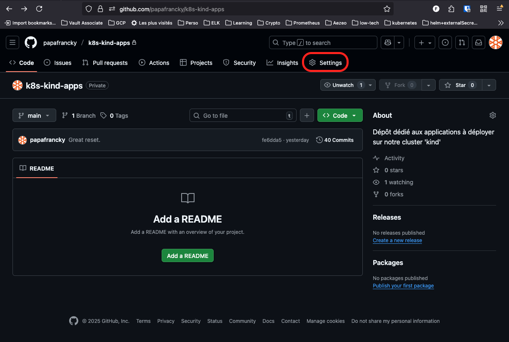
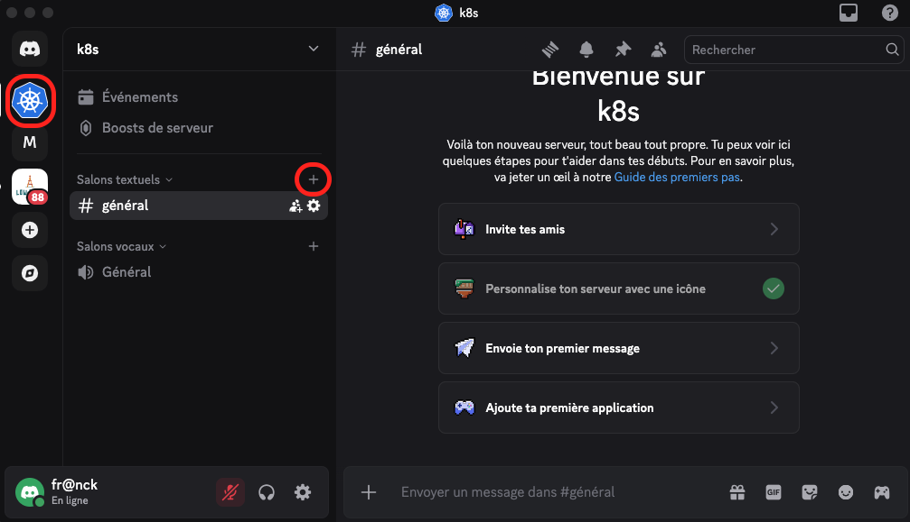

# FluxCD - Démonstration par l'exemple

----------------------------------------------------------------------------------------------------
## Abstract

Sur un cluster *Rancher Desktop* fraîchement déployé, nous installerons FluxCD (ie. *'bootstrap'*) pour gérer le déploiement et la mise à jour de 2 applications très simples. La première voit son code source hébergé dans un dépôt Git tandis que la seconde est packagée et mise à disposition dans un dépôt Helm. Nous couvrirons donc ces deux types de déploiement.

Nous mettrons également en place des notifications pour nous alerter via une messagerie instantanée (*Discord*) des évolutions éventuelles de nos applications.


----------------------------------------------------------------------------------------------------
## Pré-requis


### Préparation de notre environnement de travail en local

Nous aurons déjà suivi les howtos suivant pour préparer notre environnement de travail sur notre laptop avec les CLIs et un cluster Kins opérationnel :

|howto|Link|
|-----|---|
|Command Line Tools|[https://papafrancky.github.io/000_setup/Command_line_tools/](https://papafrancky.github.io/000_setup/Command_line_tools/)|
|Kubernetes en local|[https://papafrancky.github.io/000_setup/Kubernetes_en_local/](https://papafrancky.github.io/000_setup/Kubernetes_en_local/)|


### Création des dépôts GitHub

Commençons par nous authentifier sur GitHub et créons deux nouveaux dépôts privés :

|Dépôt|Usage|
|---|---|
|k8s-kind-fluxcd|dépôt GitHub dédié à FluxCD sur notre cluster|
|k8s-kind-apps|dépôt GitHub dédié à l'hébergement des applications à déployer via FluxCD|

!!! note
    Nos dépôts ont pour préfixe '*k8s-kind-*' parce que nous utilisions préalablement pour nos travaux pratiques un cluster local '*KinD*' (ie. '[*Kubernetes in Docker*](https://kind.sigs.k8s.io/)'). Nous avons depuis opté pour '*[Rancher Desktop](https://rancherdesktop.io/)*'.

Création du dépôt GitHub dédié à FluxCD :


Création du dépôt GitHub dédié aux applications :


### Clonage des dépôts en local

Une fois les dépôts créés, nous les clonons sur notre laptop :

!!! note
    Nous clonerons tous nos dépôts dans le répertoire renseigné dans la variable __${LOCAL_GITHUB_REPOS}__.

```sh
export LOCAL_GITHUB_REPOS="${HOME}/code/github"

cd ${LOCAL_GITHUB_REPOS}
git clone git@github.com:papafrancky/k8s-kind-fluxcd.git
git clone git@github.com:papafrancky/k8s-kind-apps.git
```


----------------------------------------------------------------------------------------------------
## Bootstrap de FluxCD

Le projet Flux est composé d'un outil en ligne de commande (le Flux CLI) et d'une série de contrôleurs Kubernetes.

Pour installer FluxCD, vous devez d'abord télécharger le CLI de Flux. Ensuite, à l'aide de la CLI, vous pouvez déployer les contrôleurs Flux sur vos clusters et configurer votre premier pipeline de livraison GitOps.

La commande *'flux bootstrap github'* déploie les contrôleurs Flux sur un cluster Kubernetes et configure ces derniers pour synchroniser l'état du cluster à partir d'un dépôt GitHub. En plus d'installer les contrôleurs, la commande bootstrap pousse les manifestes de Flux vers le dépôt GitHub et configure Flux pour qu'il se mette à jour à partir de Git.

|Doc|Link|
|---|---|
|Install the Flux controllers|[https://fluxcd.io/flux/installation/#install-the-flux-controllers](https://fluxcd.io/flux/installation/#install-the-flux-controllers)|
|Flux bootstrap for GitHub|[https://fluxcd.io/flux/installation/bootstrap/github/](https://fluxcd.io/flux/installation/bootstrap/github/)|
|GitHub default environment variables|[https://docs.github.com/en/actions/learn-github-actions/variables#default-environment-variables](https://docs.github.com/en/actions/learn-github-actions/variables#default-environment-variables)|


=== "code"

    ```sh
    export GITHUB_USER=papaFrancky
    export GITHUB_TOKEN=<my_github_personal_access_token>
    export FLUXCD_GITHUB_REPO=k8s-kind-fluxcd
    
    flux bootstrap github \
      --token-auth \
      --owner ${GITHUB_USER} \
      --repository ${FLUXCD_GITHUB_REPO} \
      --branch=main \
      --path=. \
      --personal \
      --components-extra=image-reflector-controller,image-automation-controller
    ```

=== "output"

    ```sh
    ► connecting to github.com
    ► cloning branch "main" from Git repository "https://github.com/papaFrancky/k8s-kind-fluxcd.git"
    ✔ cloned repository
    ► generating component manifests
    ✔ generated component manifests
    ✔ component manifests are up to date
    ► installing components in "flux-system" namespace
    ✔ installed components
    ✔ reconciled components
    ► determining if source secret "flux-system/flux-system" exists
    ► generating source secret
    ► applying source secret "flux-system/flux-system"
    ✔ reconciled source secret
    ► generating sync manifests
    ✔ generated sync manifests
    ✔ sync manifests are up to date
    ► applying sync manifests
    ✔ reconciled sync configuration
    ◎ waiting for Kustomization "flux-system/flux-system" to be reconciled
    ✔ Kustomization reconciled successfully
    ► confirming components are healthy
    ✔ helm-controller: deployment ready
    ✔ image-automation-controller: deployment ready
    ✔ image-reflector-controller: deployment ready
    ✔ kustomize-controller: deployment ready
    ✔ notification-controller: deployment ready
    ✔ source-controller: deployment ready
    ✔ all components are healthy
    ```

Vérifions dans les événements de FluxCD :

=== "code"

    ```sh
    flux events
    ```

=== "output"

    ```sh
    LAST SEEN          TYPE    REASON                  OBJECT                          MESSAGE
    15m                     Normal  NewArtifact             GitRepository/flux-system       stored artifact for commit 'Add Flux sync manifests'
    15m                     Normal  ReconciliationSucceeded Kustomization/flux-system       Reconciliation finished in 2.536346081s, next run in 10m0s
    15m                     Normal  Progressing             Kustomization/flux-system       CustomResourceDefinition/alerts.notification.toolkit.fluxcd.io configured
                                                                                            CustomResourceDefinition/buckets.source.toolkit.fluxcd.io configured
                                                                                            CustomResourceDefinition/gitrepositories.source.toolkit.fluxcd.io configured
                                                                                            CustomResourceDefinition/helmcharts.source.toolkit.fluxcd.io configured
                                                                                            CustomResourceDefinition/helmreleases.helm.toolkit.fluxcd.io configured
                                                                                            CustomResourceDefinition/helmrepositories.source.toolkit.fluxcd.io configured
                                                                                            CustomResourceDefinition/imagepolicies.image.toolkit.fluxcd.io configured
                                                                                            CustomResourceDefinition/imagerepositories.image.toolkit.fluxcd.io configured
                                                                                            CustomResourceDefinition/imageupdateautomations.image.toolkit.fluxcd.io configured
                                                                                            CustomResourceDefinition/kustomizations.kustomize.toolkit.fluxcd.io configured
                                                                                            CustomResourceDefinition/ocirepositories.source.toolkit.fluxcd.io configured
                                                                                            CustomResourceDefinition/providers.notification.toolkit.fluxcd.io configured
                                                                                            CustomResourceDefinition/receivers.notification.toolkit.fluxcd.io configured
                                                                                            Namespace/flux-system configured
                                                                                            ServiceAccount/flux-system/helm-controller configured
                                                                                            ServiceAccount/flux-system/image-automation-controller configured
                                                                                            ServiceAccount/flux-system/image-reflector-controller configured
                                                                                            ServiceAccount/flux-system/kustomize-controller configured
                                                                                            ServiceAccount/flux-system/notification-controller configured
                                                                                            ServiceAccount/flux-system/source-controller configured
                                                                                            ClusterRole/crd-controller-flux-system configured
                                                                                            ClusterRole/flux-edit-flux-system configured
                                                                                            ClusterRole/flux-view-flux-system configured
                                                                                            ClusterRoleBinding/cluster-reconciler-flux-system configured
                                                                                            ClusterRoleBinding/crd-controller-flux-system configured
                                                                                            Service/flux-system/notification-controller configured
                                                                                            Service/flux-system/source-controller configured
                                                                                            Service/flux-system/webhook-receiver configured
                                                                                            Deployment/flux-system/helm-controller configured
                                                                                            Deployment/flux-system/image-automation-controller configured
                                                                                            Deployment/flux-system/image-reflector-controller configured
                                                                                            Deployment/flux-system/kustomize-controller configured
                                                                                            Deployment/flux-system/notification-controller configured
                                                                                            Deployment/flux-system/source-controller configured
                                                                                            Kustomization/flux-system/flux-system configured
                                                                                            NetworkPolicy/flux-system/allow-egress configured
                                                                                            NetworkPolicy/flux-system/allow-scraping configured
                                                                                            NetworkPolicy/flux-system/allow-webhooks configured
                                                                                            GitRepository/flux-system/flux-system configured
    5m29s                   Normal  ReconciliationSucceeded Kustomization/flux-system       Reconciliation finished in 761.801712ms, next run in 10m0s
    22s (x15 over 14m)      Normal  GitOperationSucceeded   GitRepository/flux-system       no changes since last reconcilation: observed revision 'main@sha1:1258fc09abf6cd1bd639cd18ce4a2e9e4c1a7a9b'
    ```

Notre dépôt GitHub doit également avoir évolué. Mettons notre copie locale à jour pour nous en assurer :

=== "code"
    ```sh
    export LOCAL_GITHUB_REPOS="${HOME}/code/github"
    cd ${LOCAL_GITHUB_REPOS}/k8s-kind-fluxcd

    git pull
    tree
    ```

=== "output"
    ```sh
    .
    └── flux-system
        ├── gotk-components.yaml
        ├── gotk-sync.yaml
        └── kustomization.yaml

    2 directories, 3 files
    ```

Listons les objets crées sur notre cluster (dans le namespace *flux-system*) :

=== "code"
    ```sh
    kubectl -n flux-system get all
    ```

=== "output"

    ```sh
    NAME                                               READY   STATUS    RESTARTS   AGE
    pod/helm-controller-57694fc9d6-pbl5c               1/1     Running   0          19m
    pod/image-automation-controller-5f7d999559-49fms   1/1     Running   0          19m
    pod/image-reflector-controller-58db7c9785-mjfh5    1/1     Running   0          19m
    pod/kustomize-controller-7f689848b9-k7hmd          1/1     Running   0          19m
    pod/notification-controller-6cffcffd7d-rkmwl       1/1     Running   0          19m
    pod/source-controller-7f95c446b6-b8gcd             1/1     Running   0          19m
    
    NAME                              TYPE        CLUSTER-IP     EXTERNAL-IP   PORT(S)   AGE
    service/notification-controller   ClusterIP   10.96.206.29   <none>        80/TCP    19m
    service/source-controller         ClusterIP   10.96.94.126   <none>        80/TCP    19m
    service/webhook-receiver          ClusterIP   10.96.125.18   <none>        80/TCP    19m
    
    NAME                                          READY   UP-TO-DATE   AVAILABLE   AGE
    deployment.apps/helm-controller               1/1     1            1           19m
    deployment.apps/image-automation-controller   1/1     1            1           19m
    deployment.apps/image-reflector-controller    1/1     1            1           19m
    deployment.apps/kustomize-controller          1/1     1            1           19m
    deployment.apps/notification-controller       1/1     1            1           19m
    deployment.apps/source-controller             1/1     1            1           19m
    
    NAME                                                     DESIRED   CURRENT   READY   AGE
    replicaset.apps/helm-controller-57694fc9d6               1         1         1       19m
    replicaset.apps/image-automation-controller-5f7d999559   1         1         1       19m
    replicaset.apps/image-reflector-controller-58db7c9785    1         1         1       19m
    replicaset.apps/kustomize-controller-7f689848b9          1         1         1       19m
    replicaset.apps/notification-controller-6cffcffd7d       1         1         1       19m
    replicaset.apps/source-controller-7f95c446b6             1         1         1       19m
    ```


----------------------------------------------------------------------------------------------------
## Intégration continue avec FluxCD 

FluxCD peut gérer l'automatisation des déploiements d'applications packagées avec Helm ou bien directement depuis un dépôt Git. Nous allons d'abord nous concentrer sur le déploiement d'applications depuis un dépôt Git (GitHub dans notre cas).

Les objets de FluxCD sont un peu comme des poupées Russes, il est important de garder en tête leurs interdépendances pour comprendre l'ordre dans lequel nous devrons les créer.


### Gestion des applications depuis un dépôt Git


#### Namespaces dédiés à l'application

Pour illustrer l'intégration continue d'une application dont le code source est hébergé dans un dépôt Git, nous prendrons une application simple : '*agnhost*'.

!!! Info
    [Informations sur l'application '*agnhost*'](https://pkg.go.dev/k8s.io/kubernetes/test/images/agnhost#section-readme)

L'application sera exécutée dans un namespace éponyme dédié que nous devons créer. Le manifest YAML de création du namespace sera placé dans le dépôt GitHub dédié à FluxCD :

=== "code"
    ```sh
    export LOCAL_GITHUB_REPOS="${HOME}/code/github"
    
    cd ${LOCAL_GITHUB_REPOS}/k8s-kind-fluxcd
    mkdir -p apps/agnhost
        
    kubectl create namespace agnhost --dry-run=client -o yaml > apps/agnhost/agnhost.namespace.yaml
    ```

=== "namespace 'agnhost'"
    ```sh
    apiVersion: v1
    kind: Namespace
    metadata:
      creationTimestamp: null
      name: agnhost
    spec: {}
    status: {}
    ```


#### Dépôt GitHub dédié aux applications

Nous décidons ici d'héberger toutes nos applications dans un seul dépôt GitHub (mais nous aurions très bien pu décider que chaque application disposait d'un dépôt GitHub qui serait dédié) : `github.com/${GITHUB_USERNAME}/k8s-kind-apps`.


#### Le micro-service '*agnhost*'

Plus haut, nous avons montré comment le définir sur la plate-forme GitHub, puis comment créer une copie de ce dernier en local avec la commande `git clone`.

Dans cette copie locale, nous allons définir le micro-service '*agnhost*' composé d'un '*deployment*' et d'un '*service*' :

=== "code"
    ```sh
    export LOCAL_GITHUB_REPOS="${HOME}/code/github"

    cd ${LOCAL_GITHUB_REPOS}/k8s-kind-apps
    mkdir agnhost

    # deployment :
    cat << EOF >> agnhost/agnhost.deployment.yaml
    apiVersion: apps/v1
    kind: Deployment
    metadata:
      labels:
        app: agnhost
      name: agnhost
      namespace: agnhost
    spec:
      replicas: 1
      selector:
        matchLabels:
          app: agnhost
      template:
        metadata:
          labels:
            app: agnhost
        spec:
          containers:
          - name: agnhost
            image: registry.k8s.io/e2e-test-images/agnhost:2.39
            command:
            - /agnhost
            - netexec
            - --http-port
            - "8080"
    EOF

    # service : 
    cat << EOF >> agnhost/agnhost.service.yaml
    ---
    kind: Service
    apiVersion: v1
    metadata:
      name: agnhost
      namespace: agnhost
    spec:
      selector:
        app: agnhost
      ports:
      # Default port used by the image
      - port: 8080
    EOF

    # Arborescence des fichiers générés :
    tree
    ```

=== "output"
    ```sh
    .
    └── agnhost
        ├── agnhost.deployment.yaml
        └── agnhost.service.yaml

    2 directories, 2 files
    ```


#### Définition du GitRepository

!!! Doc
    [https://fluxcd.io/flux/components/source/gitrepositories/](https://fluxcd.io/flux/components/source/gitrepositories/)

Nous allons définir au niveau de FluxCD le dépôt GitHub qui hébergera nos applications et lui permettre de s'y connecter avec des droits d'écriture : `k8s-kind-apps`.


##### Deploy Keys

Pour permettre à FluxCD de se connecter au dépôt GitHub des applications dont il doit gérer l'intégration continue, nous devons créer une paire de clés SSH et déployer la clé publique sur les dépôts concernés.

Nous avons besoin de définir les '*deploy keys*' avant de pouvoir définir un '*GitRepository*'.

S'agissant de '*secrets*', nous ne conserverons pas le manifest YAML un le dépôt GitHub. La solution idéale serait d'utiliser un coffre (ou '*vault*') pour gérer les '*secrets*' en toute sécurité, sujet que nous couvrirons dans un autre HOWTO.


###### Création des *'Deploy Keys'*

```sh
export GITHUB_USERNAME=papafrancky
export LOCAL_GITHUB_REPOS="${HOME}/code/github"

cd ${LOCAL_GITHUB_REPOS}/k8s-kind-fluxcd

flux create secret git k8s-kind-apps-gitrepository-deploykeys \
  --url=ssh://github.com/${GITHUB_USERNAME}/k8s-kind-apps \
  --namespace=agnhost \
  --export > apps/agnhost/k8s-kind-apps.gitrepository.deploykeys.yaml
```

Nous devons pousser notre code sur notre dépôt GitHub et attendre que FluxCD créé le namespace de notre application et surtout, les '*deploy keys*' que nous devrons renseigner sur le dépôt de nos applications ('*k8s-kind-apps*') pour permettre à FluxCD d'y accéder (et avec des droits de modification) :

=== "code"
    ```sh
    export LOCAL_GITHUB_REPOS="${HOME}/code/github"

    cd ${LOCAL_GITHUB_REPOS}/k8s-kind-fluxcd

    git add .
    git commit -m 'agnhost : namespace and GitRepository definitions.'
    git push

    flux reconcile kustomization flux-system --with-source
    ```

Vérifions la bonne création du '*namespace*' :

=== "code"
    ```sh
    kubectl get namespace agnhost
    ```

=== "output"
    ```sh
    NAME      STATUS   AGE
    agnhost   Active   30s
    ```

Vérifions ensuite la bonne création de la '*deploy key*' pour de dépôt des applications :

=== "code"
    ```sh
    kubectl -n agnhost get secret k8s-kind-apps-gitrepository-deploykeys
    ```

=== "output"
    ```sh
    NAME                                     TYPE     DATA   AGE
    k8s-kind-apps-gitrepository-deploykeys   Opaque   3      35s
    ```

De ce '*secret*' qui contient un jeu de clés privée et publique, nous devons extraire la clé publique pour la renseigner sur notre dépôt GitHub :

=== "code"
    ```sh
    kubectl -n agnhost get secret k8s-kind-apps-gitrepository-deploykeys -o jsonpath='{.data.identity\.pub}' | base64 -D
    ```

=== "output"
    ```sh
    ecdsa-sha2-nistp384 AAAAE2VjZHNhLXNoYTItbmlzdHAzODQAAAAIbmlzdHAzODQAAABhBN8q8Xb3gUEQkhoLmYDlAnYdom1GBC+mJ//OH1r4OJvYszU0zBhq2+Xa9P3O6CywbRYIaP8yCtO+NBpZGx8ZDPP1WfgPDs5BPjLVE6Q+HNskPsx4sNHkM3SIc/BcFnzMUw==
    ```

Une fois sur la page de dépôt, cliquer sur le bouton _*Settings*_, puis dans la colonne de gauche sur la page suivante, sur le line _*Deploy Keys*_ dans la partie 'Security' :




!!! warning
    La case __'Allow write access'__ doit être cochée pour permettre à FluxCD d'apporter des modifications dans le dépôt !


##### Définition du GitRepository *"k8s-kind-apps"*

!!! Doc
    [https://fluxcd.io/flux/components/source/gitrepositories/](https://fluxcd.io/flux/components/source/gitrepositories/)

Voici les informations qu'il faudra donner pour définir un 'GitRepository' :

* Le nom que nous souhaitons lui donner : *k8s-kind-apps*;
* L'URL du dépôt GitHub : *ssh://git@github.com/${GITHUB_USERNAME}/k8s-kind-apps.git*;
* La branche du dépôt d'où récupérer le code : *main*;
* Le secret d'où extraire la clé privée pour se connecter au dépôt GitHub : *k8s-kind-apps-gitrepository-deploykeys*.


=== "code"
    ```sh
    export LOCAL_GITHUB_REPOS="${HOME}/code/github"
    export GITHUB_USERNAME=papafrancky

    cd ${LOCAL_GITHUB_REPOS}/k8s-kind-fluxcd
    
    flux create source git k8s-kind-apps \
      --url=ssh://git@github.com/${GITHUB_USERNAME}/k8s-kind-apps.git \
      --branch=main \
      --secret-ref=k8s-kind-apps-gitrepository-deploykeys \
      --namespace=agnhost \
      --export > apps/agnhost/k8s-kind-apps.gitrepository.yaml
    ```
   
=== "'k8s-kind-apps' GitRepository"
    ```sh
    ---
    apiVersion: source.toolkit.fluxcd.io/v1
    kind: GitRepository
    metadata:
      name: k8s-kind-apps
      namespace: agnhost
    spec:
      interval: 1m0s
      ref:
        branch: main
      secretRef:
        name: k8s-kind-apps-gitrepository-deploykeys
      url: ssh://git@github.com/papafrancky/k8s-kind-apps.git
    ```


XXXXX

#### Définition des *'Kustomizations'* pour chacun des GitRepositories

!!! doc
    https://fluxcd.io/flux/cmd/flux_create_kustomization/
    https://fluxcd.io/flux/components/kustomize/kustomizations/

!!! tip
    Nommer le manifest 'kustomize.yml' pose des problèmes, le nom doit être réservé pour les besoins internes de Flux. Nous le nommerons 'sync.yaml'.

=== "code"
    ```sh
    export LOCAL_GITHUB_REPOS="${HOME}/code/github"
    cd ${LOCAL_GITHUB_REPOS}/k8s-kind-fluxcd

    flux create kustomization foo \
        --source=GitRepository/k8s-kind-apps.foo \
        --path=./foo \
        --prune=true \
        --namespace=foo
        --export  > apps/foo/sync.yaml

    flux create kustomization bar \
        --source=GitRepository/k8s-kind-apps.bar \
        --path=./bar \
        --prune=true \
        --namespace=bar \
        --export > apps/bar/sync.yaml
    ```

=== "'foo' kustomization"
    ```sh
    ---
    apiVersion: kustomize.toolkit.fluxcd.io/v1
    kind: Kustomization
    metadata:
    name: foo
    namespace: foo
    spec:
    interval: 1m0s
    path: "./foo"
    prune: true
    sourceRef:
      kind: GitRepository
      name: k8s-kind-apps
      namespace: foo
    ```

=== "'bar' kustomization"
    ```sh
    ---
    apiVersion: kustomize.toolkit.fluxcd.io/v1
    kind: Kustomization
    metadata:
      name: bar
      namespace: bar
    spec:
      interval: 1m0s
      path: ./bar
      prune: true
      sourceRef:
        kind: GitRepository
        name: k8s-kind-apps
        namespace: bar
    ```


Il est temps de pousser nos modifications dans le dépôt GitHub :

```sh
   export LOCAL_GITHUB_REPOS="${HOME}/code/github"
   cd ${LOCAL_GITHUB_REPOS}/k8s-kind-fluxcd

   git status
   git add .
   git commit -m "feat: added GitRepositories and Kustomizations for 'foo' and 'bar' apps."
   git push
```

Forçons la réconciliation :

=== "code"
    ```sh
    flux reconcile kustomization flux-system --with-source
    ```

=== "output"
    ```sh
    ► annotating GitRepository flux-system in flux-system namespace
    ✔ GitRepository annotated
    ◎ waiting for GitRepository reconciliation
    ✔ fetched revision main@sha1:f9875e137abb0d4f810b4042fa98713adaca2701
    ► annotating Kustomization flux-system in flux-system namespace
    ✔ Kustomization annotated
    ◎ waiting for Kustomization reconciliation
    ✔ applied revision main@sha1:f9875e137abb0d4f810b4042fa98713adaca2701
    ```

Nous devrions désormais voir le GitRepository défini au niveau du cluster :

=== "code"
    ```
    k -n foo get gitrepository k8s-kind-apps
    k -n bar get gitrepository k8s-kind-apps
    ```

=== "output "
    ```
    NAME            URL                                                  AGE     READY   STATUS
    k8s-kind-apps   ssh://git@github.com/papafrancky/k8s-kind-apps.git   2m11s   True    stored artifact for revision 'main@sha1:cfe1c35724883dce2eaf428f144faeb3da27873b'
        
    NAME            URL                                                  AGE     READY   STATUS
    k8s-kind-apps   ssh://git@github.com/papafrancky/k8s-kind-apps.git   2m28s   True    stored artifact for revision 'main@sha1:cfe1c35724883dce2eaf428f144faeb3da27873b'
    ```

Surtout, nous devrions voir nos applications 'foo' et 'bar' déployées sur le cluster :

=== "code"
    ```sh
    kubectl -n foo get deployments,services,pods
    kubectl -n bar get deployments,services,pods
    ```

=== "foo output"
    ```sh
    NAME                  READY   UP-TO-DATE   AVAILABLE   AGE
    deployment.apps/foo   1/1     1            1           3m30s
    
    NAME          TYPE        CLUSTER-IP     EXTERNAL-IP   PORT(S)    AGE
    service/foo   ClusterIP   10.96.81.216   <none>        8080/TCP   3m30s

    NAME                       READY   STATUS    RESTARTS   AGE
    pod/foo-6f6cb79d96-bdjpq   1/1     Running   0          3m30s
    ```

=== "bar output"
    ```sh    
    NAME                  READY   UP-TO-DATE   AVAILABLE   AGE
    deployment.apps/bar   1/1     1            1           4m53s

    NAME          TYPE        CLUSTER-IP    EXTERNAL-IP   PORT(S)    AGE
    service/bar   ClusterIP   10.96.43.89   <none>        8080/TCP   4m53s

    NAME                       READY   STATUS    RESTARTS   AGE
    pod/bar-764bd8d889-8wqq2   1/1     Running   0          4m53s
    ```


### ImageRepository

!!! info
    [https://pkg.go.dev/k8s.io/kubernetes/test/images/agnhost#section-readme](https://pkg.go.dev/k8s.io/kubernetes/test/images/agnhost#section-readme)

Nos deux applications _*'foo'*_ et _*'bar'*_ utilisent une même image Docker ("__e2e-test-images/agnhost__") et nous aimerions qu'elle soit mise à jour automatiquement si une nouvelle version venait à être publiée.
La mise en place d'un tel process d'automatisation nécessite la définition préalable d'un __'ImageRepository'__ auquel nous associerons une __'ImagePolicy'__.

=== "code"
    ```sh
    export LOCAL_GITHUB_REPOS="${HOME}/code/github"
    export GITHUB_USERNAME=papafrancky
    
    cd ${LOCAL_GITHUB_REPOS}/k8s-kind-fluxcd
    
    flux create image repository agnhost \
      --image=registry.k8s.io/e2e-test-images/agnhost \
      --interval=5m \
      --namespace=foo \
      --export > apps/foo/agnhost.imagerepository.yaml

    flux create image repository agnhost \
      --image=registry.k8s.io/e2e-test-images/agnhost \
      --interval=5m \
      --namespace=bar \
      --export > apps/bar/agnhost.imagerepository.yaml

    git add .
    git commit -m "feat: added image repository for foo and bar apps."
    git push
    ```

=== "'foo' ImagePolicy"
    ```sh
    ---
    apiVersion: image.toolkit.fluxcd.io/v1beta2
    kind: ImageRepository
    metadata:
      name: agnhost
      namespace: foo
    spec:
      image: registry.k8s.io/e2e-test-images/agnhost
      interval: 5m0s
    ```

=== "'bar' ImagePolicy"
    ```sh
    ---
    apiVersion: image.toolkit.fluxcd.io/v1beta2
    kind: ImageRepository
    metadata:
      name: agnhost
      namespace: bar
    spec:
      image: registry.k8s.io/e2e-test-images/agnhost
      interval: 5m0s
    ```

Vérifions la bonne création des *'ImagePolicies'*:

=== "code"
    ```sh
    kubectl -n foo get imagerepository agnhost -o yaml
    kubectl -n bar get imagerepository agnhost -o yaml
    ```

=== "foo ImageRepository"
    ```sh
    apiVersion: image.toolkit.fluxcd.io/v1beta2
    kind: ImageRepository
    metadata:
      creationTimestamp: "2024-04-27T09:52:39Z"
      finalizers:
      - finalizers.fluxcd.io
      generation: 1
      labels:
        kustomize.toolkit.fluxcd.io/name: flux-system
        kustomize.toolkit.fluxcd.io/namespace: flux-system
      name: agnhost
      namespace: foo
      resourceVersion: "1305975"
      uid: d078ca2e-f277-4d29-bdd3-ef140d6e34a8
    spec:
      exclusionList:
      - ^.*\.sig$
      image: registry.k8s.io/e2e-test-images/agnhost
      interval: 5m0s
      provider: generic
    status:
      canonicalImageName: registry.k8s.io/e2e-test-images/agnhost
      conditions:
      - lastTransitionTime: "2024-04-27T09:52:39Z"
        message: 'successful scan: found 27 tags'
        observedGeneration: 1
        reason: Succeeded
        status: "True"
        type: Ready
      lastScanResult:
        latestTags:
        - "2.9"
        - "2.51"
        - "2.50"
        - "2.48"
        - "2.47"
        - "2.45"
        - "2.44"
        - "2.43"
        - "2.41"
        - "2.40"
        scanTime: "2024-04-27T09:52:39Z"
        tagCount: 27
      observedExclusionList:
      - ^.*\.sig$
      observedGeneration: 1
    ```

=== "bar ImageRepository"
    ```sh
    apiVersion: image.toolkit.fluxcd.io/v1beta2
    kind: ImageRepository
    metadata:
      creationTimestamp: "2024-04-27T09:52:38Z"
      finalizers:
      - finalizers.fluxcd.io
      generation: 1
      labels:
        kustomize.toolkit.fluxcd.io/name: flux-system
        kustomize.toolkit.fluxcd.io/namespace: flux-system
      name: agnhost
      namespace: bar
      resourceVersion: "1305978"
      uid: 57f01130-5ef2-42e2-be24-5509c5232898
    spec:
      exclusionList:
      - ^.*\.sig$
      image: registry.k8s.io/e2e-test-images/agnhost
      interval: 5m0s
      provider: generic
    status:
      canonicalImageName: registry.k8s.io/e2e-test-images/agnhost
      conditions:
      - lastTransitionTime: "2024-04-27T09:52:39Z"
        message: 'successful scan: found 27 tags'
        observedGeneration: 1
        reason: Succeeded
        status: "True"
        type: Ready
      lastScanResult:
        latestTags:
        - "2.9"
        - "2.51"
        - "2.50"
        - "2.48"
        - "2.47"
        - "2.45"
        - "2.44"
        - "2.43"
        - "2.41"
        - "2.40"
        scanTime: "2024-04-27T09:52:39Z"
        tagCount: 27
      observedExclusionList:
      - ^.*\.sig$
      observedGeneration: 1
    ```

Nous pouvons d'ores et déjà constater que nous n'utilisons pas la version la plus récente de l'image __*'e2e-test-images/agnhost'*__.


### ImagePolicy

* nous utilisons la version __2.39__ :

=== "code"
    ```sh
    kubectl -n foo get deployment foo -o jsonpath='{.spec.template.spec.containers[].image}'
    ```

=== "output"
    ```sh
    registry.k8s.io/e2e-test-images/agnhost:2.39
    ```

* la version la plus récente est la __2.57__ :

=== "code"
    ```sh
    kubectl -n foo get imagerepository agnhost -o jsonpath='{.status.lastScanResult.latestTags}' | jq -r '.'
    ```

=== "output"
    ```sh
       [
          "2.9",
          "2.57",
          "2.56",
          "2.55",
          "2.54",
          "2.53",
          "2.52",
          "2.51",
          "2.50",
          "2.48"
       ]
    ```

Nous souhaitons disposer de l'image la plus récente de l'application (dans notre cas, ce serait la version 2.57). Nous pouvons demander à FluxCD de gérer ces mises à jour automatiquement en définissant une __*'ImagePolicy'*__ qui précisera le ou nos critères de sélection (dans notre cas, l'image la plus récente).

!!! doc
    [https://fluxcd.io/flux/components/image/imagepolicies/#policy](https://fluxcd.io/flux/components/image/imagepolicies/#policy)

    [https://github.com/Masterminds/semver#checking-version-constraints](https://github.com/Masterminds/semver#checking-version-constraints)

!!! warning
    Les images dans le dépôt ne sont suivent pas le versionnement 'SemVer'. Nous devons ici choisir une *policy* de type *numerical* (autres choix possibles: semver et alphabetical) et trier les tags de l'image *agnhost* par ordre croissant pour arriver à nos fins.

=== "code"
    ```
    export LOCAL_GITHUB_REPOS="${HOME}/code/github"
    export GITHUB_USERNAME=papafrancky
    
    cd ${LOCAL_GITHUB_REPOS}/k8s-kind-fluxcd
    
    flux create image policy agnhost \
      --image-ref=agnhost \
      --namespace=foo \
      --select-numeric=asc \
      --filter-regex='2\.\d\d' \        
      --export > apps/foo/agnhost.imagepolicy.yaml

flux create image policy agnhost --image-ref=agnhost --namespace=foo --select-numeric=asc  --filter-regex='2\.\d\d' --export > apps/foo/agnhost.imagepolicy.yaml    

    flux create image policy agnhost \
    --image-ref=agnhost \
    --namespace=bar \
    --select-numeric=asc \
    --filter-regex='\d\.\d\d' \
    --export > apps/bar/agnhost.imagepolicy.yaml

    git add .
    git commit -m "feat: defined an image policy for foo and bar apps."
    git push

    flux reconcile kustomization flux-system --with-source
    ```

=== "foo ImagePolicy"
    ```sh
    ---
    apiVersion: image.toolkit.fluxcd.io/v1beta2
    kind: ImagePolicy
    metadata:
      name: agnhost
      namespace: foo
    spec:
      imageRepositoryRef:
        name: agnhost
      filterTags:
        pattern: '\d\.\d\d'
        extract: ""
      policy:
        numerical:
          order: asc
    ```

=== "bar ImagePolicy"
    ```sh
    ---
    apiVersion: image.toolkit.fluxcd.io/v1beta2
    kind: ImagePolicy
    metadata:
      name: agnhost
      namespace: bar
    spec:
      imageRepositoryRef:
        name: agnhost
      filterTags:
        pattern: '\d\.\d\d'
        extract: ""
      policy:
        numerical:
          order: asc
    ```

Vérifions la bonne création des Image Policies :

=== "code"
    ```sh
    kubectl get ImagePolicy -A
    ```

=== "output"
    ```sh
    NAMESPACE   NAME      LATESTIMAGE
    bar         agnhost   registry.k8s.io/e2e-test-images/agnhost:2.57
    foo         agnhost   registry.k8s.io/e2e-test-images/agnhost:2.57
    ```


### Marquage des manifests de déploiement des applications 'foo' et 'bar'

Nous devons maintenant indiquer à FluxCD où mettre le tag de l'image à jour dans les manifests de les applications 'foo' et 'bar'.
En effet, si FluxCD est capable de détecter une nouvelle version de l'image conforme à notre politique de mise à jour (dans notre cas, toutes les versions 2.xy), il doit aussi mettre le code de déploiement de l'application.

Dans le cas de nos applications, l'image Docker et sa version sont définis dans les manifests qui décrivent les *'deployments'* : 

* ${LOCAL_GITHUB_REPOS}/k8s-kind-apps/foo/__deployment.yaml__;
* ${LOCAL_GITHUB_REPOS}/k8s-kind-apps/bar/__deployment.yaml__.


Ajoutons un marqueur pour permettre à FluxCD de mettre la version de l'image à jour :

=== "code"
    ```sh
    export LOCAL_GITHUB_REPOS="${HOME}/code/github"
    export GITHUB_USERNAME=papafrancky
    
    cd ${LOCAL_GITHUB_REPOS}/k8s-kind-apps
    
    gsed -i 's/agnhost:2\.39/agnhost:2\.39 # {"$imagepolicy": "foo:agnhost"}/' foo/deployment.yaml
    gsed -i 's/agnhost:2\.39/agnhost:2\.39 # {"$imagepolicy": "bar:agnhost"}/' bar/deployment.yaml
    
    git add .
    git commit -m "feat: added a marker on foobar's pods manifests."
    git push

    flux reconcile kustomization flux-system --with-source
    ```   

!!! info "Configure image update for custom resources"
    [https://fluxcd.io/flux/guides/image-update/#configure-image-update-for-custom-resources](https://fluxcd.io/flux/guides/image-update/#configure-image-update-for-custom-resources)


Le format du marqueur de l'image policy est le suivant :
```sh
* {"$imagepolicy": "<policy-namespace>:<policy-name>"}
* {"$imagepolicy": "<policy-namespace>:<policy-name>:tag"}
* {"$imagepolicy": "<policy-namespace>:<policy-name>:name"}
```


=== "'foo' deployment.yaml"
    ```sh
    apiVersion: apps/v1
    kind: Deployment
    metadata:
      name: foo
      namespace: foo
      labels:
        app: foo
    spec:
      replicas: 1
      selector:
        matchLabels:
          app: foo
      template:
        metadata:
          labels:
            app: foo
        spec:
          containers:
          - name: agnhost
            image: registry.k8s.io/e2e-test-images/agnhost:2.39 # {"$imagepolicy": "foo:agnhost"}
            command:
            - /agnhost
            - netexec
            - --http-port
            - "8080"
    ```

=== "'bar' deployment.yaml"
    ```sh
    apiVersion: apps/v1
    kind: Deployment
    metadata:
      name: bar
      namespace: bar
      labels:
        app: bar
    spec:
      replicas: 1
      selector:
        matchLabels:
          app: bar
      template:
        metadata:
          labels:
            app: bar
        spec:
          containers:
          - name: agnhost
            image: registry.k8s.io/e2e-test-images/agnhost:2.39 # {"$imagepolicy": "bar:agnhost"}
            command:
            - /agnhost
            - netexec
            - --http-port
            - "8080"
    ```


### Image Update Automation

Il ne nous reste plus qu'à tout mettre en musique en créant une 'ImageUpdateAutomation' pour chacune de nos applications.


!!! info "flux create image update"
    https://fluxcd.io/flux/cmd/flux_create_image_update/#examples

=== "code"
    ```sh
    export LOCAL_GITHUB_REPOS="${HOME}/code/github"
    export AUTHOR_EMAIL="19983231-papafrancky@users.noreply.github.com"

    cd ${LOCAL_GITHUB_REPOS}/k8s-kind-fluxcd

    flux create image update agnhost \
        --namespace=foo \
        --git-repo-ref=k8s-kind-apps \
        --git-repo-path="./foo" \
        --checkout-branch=main \
        --author-name=FluxCD \
        --author-email=${AUTHOR_EMAIL} \
        --commit-template="{{range .Updated.Images}}{{println .}}{{end}}" \
        --export > apps/foo/agnhost.imageupdateautomation.yaml
    
    flux create image update agnhost \
        --namespace=bar \
        --git-repo-ref=k8s-kind-apps \
        --git-repo-path="./bar" \
        --checkout-branch=main \
        --author-name=FluxCD \
        --author-email=${AUTHOR_EMAIL} \
        --commit-template="{{range .Updated.Images}}{{println .}}{{end}}" \
        --export > apps/bar/agnhost.imageupdateautomation.yaml
    
    git add .
    git commit -m "feat: added ImageUpdateAutomations to foo and bar applications respectively."
    git push

    flux reconcile kustomization flux-system --with-source
    ```

=== "'foo' ImageUpdateAutomation"
    ```sh
    ---
    apiVersion: image.toolkit.fluxcd.io/v1beta1
    kind: ImageUpdateAutomation
    metadata:
      name: agnhost
      namespace: foo
    spec:
      git:
        checkout:
          ref:
            branch: main
        commit:
          author:
            email: 19983231-papafrancky@users.noreply.github.com
            name: FluxCD
          messageTemplate: '{{range .Updated.Images}}{{println .}}{{end}}'
      interval: 1m0s
      sourceRef:
        kind: GitRepository
        name: k8s-kind-apps
      update:
        path: ./foo
        strategy: Setters
    ```

=== "'bar' ImageUpdateAutomation"
    ```sh
    ---
    apiVersion: image.toolkit.fluxcd.io/v1beta1
    kind: ImageUpdateAutomation
    metadata:
      name: agnhost
      namespace: bar
    spec:
      git:
        checkout:
          ref:
            branch: main
        commit:
          author:
            email: 19983231-papafrancky@users.noreply.github.com
            name: FluxCD
          messageTemplate: '{{range .Updated.Images}}{{println .}}{{end}}'
      interval: 1m0s
      sourceRef:
        kind: GitRepository
        name: k8s-kind-apps
      update:
        path: ./bar
        strategy: Setters
    ```


!!! note "Définir son adresse email de commit"
    [https://docs.github.com/en/account-and-profile/setting-up-and-managing-your-personal-account-on-github/managing-email-preferences/setting-your-commit-email-address#about-commit-email-addresses](https://docs.github.com/en/account-and-profile/setting-up-and-managing-your-personal-account-on-github/managing-email-preferences/setting-your-commit-email-address#about-commit-email-addresses)

!!! note "Comment récupérer l'ID de son compte GitHub"
    https://api.github.com/users/${GITHUB_USERNAME}


Surveillons la mise à jour des images :

```sh
kubectl get pods --all-namespaces -l 'app in (foo, bar)'  -w
```


Vérifions la version des images utilisées :

=== "code"
    ```sh
    kubectl get pod --all-namespaces -l 'app in (foo, bar)' -o jsonpath='{.items[*].spec.containers[*].image}'
    ```

=== "avant"
    ```sh
    registry.k8s.io/e2e-test-images/agnhost:2.39 registry.k8s.io/e2e-test-images/agnhost:2.39%
    ```

=== "après"
    ```
    registry.k8s.io/e2e-test-images/agnhost:2.51 registry.k8s.io/e2e-test-images/agnhost:2.57%
    ```

Enfin, assurons-nous que FluxCD ait bien pu modifier le _*deployment*_ des applications pour prendre la version de l'image la plus récente en compte :

!!! warning
    Nous devons mettre à jour notre copie locale du dépôt des applications pour constater la boone réécriture de FluxCD.

=== "code"
    ```sh
       export LOCAL_GITHUB_REPOS="${HOME}/code/github"
    
       cd ${LOCAL_GITHUB_REPOS}/k8s-kind-apps
       git fetch
       git pull
    ```

=== "output"
    ```sh
    Mise à jour 17cb1e2..0925cae
    Fast-forward
     bar/deployment.yaml | 2 +-
     foo/deployment.yaml | 2 +-
     2 files changed, 2 insertions(+), 2 deletions(-)
    ```

Les manifests ont bien été modifiés.
Vérifions la mise à jour de la version des images :

=== "code"
    ```sh
    cat */deployment.yaml | grep image
    ```

=== "output"
    ```sh
    image: registry.k8s.io/e2e-test-images/agnhost:2.57 # {"$imagepolicy": "bar:agnhost"}
    image: registry.k8s.io/e2e-test-images/agnhost:2.57 # {"$imagepolicy": "foo:agnhost"}
    ```

Les images sont passées de la version initiale (2.39) à la version la plus récente conforme à l'ImagePolicy (2.57).

Tout fonctionne comme attendu ! :fontawesome-regular-face-laugh-wink:


## Gestion automatique des déploiements d'applications packagées avec Helm

Nous venons de couvrir la mise en place du déploiement géré par FluxCD d'applications dont les manifests YAML sont hébergés dans un dépôt Git.
Pour être complet, FluxCD gère également le déploiement d'applications packagées avec Helm et c'est ce sur quoi nous allons nous concentrer à présent.

Pour illustrer le déploiement d'applications Helm, nous déploierons l'application *'podinfo'* utilisée par le projet CNCF FluxCD pour faire des tests end-to-end et des workshops.

!!! info
    [https://github.com/stefanprodan/podinfo](https://github.com/stefanprodan/podinfo)


### Namespace dédié à l'application *'podinfo'*

=== "code"
    ```sh
       export LOCAL_GITHUB_REPOS="${HOME}/code/github"
       
       cd ${LOCAL_GITHUB_REPOS}/k8s-kind-fluxcd
       mkdir apps/podinfo

       kubectl create namespace podinfo --dry-run=client -o yaml > ./apps/podinfo/namespace.yaml
       kubectl apply -f ./apps/podinfo/namespace.yaml
    ```

=== "podinfo namespace"
    ```sh
    apiVersion: v1
    kind: Namespace
    metadata:
      creationTimestamp: null
      name: foo
    spec: {}
     status: {}
    ```

### Le Helm Chart *'podinfo'*

Le dépôt GitHub de l'application *'podinfo'* propose un Helm Chart :


Nous y trouverons l'adresse où le récupérer : `oci://ghcr.io/stefanprodan/charts/podinfo`


Nous devons commencer par nous authentifier auprès de la '*GitHub Container Registry*' :

!!! doc
    [Authenticating to the GitHub container registry with a personal access token](https://docs.github.com/en/packages/working-with-a-github-packages-registry/working-with-the-container-registry#authenticating-with-a-personal-access-token-classic)

=== "code"
    ```sh    
    export GITHUB_USER=papaFrancky
    export GITHUB_TOKEN=<my_github_personal_access_token>

    echo ${GITHUB_TOKEN} | docker login ghcr.io -u ${GITHUB_USER} --password-stdin
    ```

=== "output"
    ```sh
    Login Succeeded
    ```

Nous sommes désormais en mesure de l'interroger :

=== "code"
    ```sh
    helm show chart oci://ghcr.io/stefanprodan/charts/podinfo
    ```

=== "output"
    ```sh
    Pulled: ghcr.io/stefanprodan/charts/podinfo:6.9.2
    Digest: sha256:971fef0d04d5b3d03d035701dad59411ea0f60e28d16190f02469ddfe5587588
    apiVersion: v1
    appVersion: 6.9.2
    description: Podinfo Helm chart for Kubernetes
    home: https://github.com/stefanprodan/podinfo
    kubeVersion: '>=1.23.0-0'
    maintainers:
    - email: stefanprodan@users.noreply.github.com
      name: stefanprodan
    name: podinfo
    sources:
    - https://github.com/stefanprodan/podinfo
    version: 6.9.2    
    ```

L'adresse du Helm Chart est vérifiée et exploitable, nous pouvons continuer.


### Définition du HelmRepository '*podinfo*'

#### Authentification à la Container Registry

Nous devons créer un '*secret*' de type '*Docker registry*' pour nous y authentifier, comme nous venons de le faire pour récupérer des informations à propos du Helm Chart. S'agissant d'un '*secret*', nous ne le placerons pas dans notre dépôt GitHub.

=== "code"
    ```sh
    export GITHUB_USER=papafrancky
    export GITHUB_TOKEN=<my_github_personal_access_token>

    kubectl create secret docker-registry github \
      --namespace=podinfo \
      --docker-server=ghcr.io \
      --docker-username=${GITHUB_USER} \
      --docker-password=${GITHUB_TOKEN}
    ```


#### Définition du HelmRepository

=== "code"
    ```sh
    export LOCAL_GITHUB_REPOS="${HOME}/code/github"
       
    cd ${LOCAL_GITHUB_REPOS}/k8s-kind-fluxcd

    flux create source helm podinfo \
    --namespace=podinfo \
    --url=https://stefanprodan.github.io/podinfo \
    --secret-ref=github \
    --interval=10m \
    --export > ./apps/podinfo/podinfo.helmrepository.yaml

    git add .
    git commit -m 'Created namespace and helmrepository for podinfo application.'
    git push
    ```

=== "podinfo HelmRepository"
    ```sh
    ---
    apiVersion: source.toolkit.fluxcd.io/v1
    kind: HelmRepository
    metadata:
      name: podinfo
      namespace: podinfo
    spec:
      interval: 10m0s
      secretRef:
        name: github
      url: https://stefanprodan.github.io/podinfo
    ```

#### Kustomization liée au dépôt GitHub de l'application '*podinfo*'

Dans la ségrégation des rôles Dev|Ops, la définition de la HelmRelease incombera à l'équipe de Dev en charge de l'application.
C'est elle qui personnalisera son application en surchargeant les valeurs par défaut de la Helm Chart utilisée.
Ces objets seront donc définis dans des manifests YAML dans le dépôt GitHub dédié aux applications : `https://github.com/${GITHUB_USER}/k8s-kind-apps`.

Nous devons indiquer à FluxCD qu'il doit gérer les manifests qu'il y trouvera dans le sous-répertoire dédié à '*podinfo*' : `./podinfo`


=== "code"
    ```sh
    export GITHUB_USERNAME=papafrancky
    export LOCAL_GITHUB_REPOS="${HOME}/code/github"

    cd ${LOCAL_GITHUB_REPOS}/k8s-kind-fluxcd

    # Définition du 'secret' permettant de s'authentifier à GitHub
    flux create secret git k8s-kind-apps \
      --url=ssh://github.com/${GITHUB_USERNAME}/k8s-kind-apps \
      --namespace=podinfo

    # Extraction de la clé publique (Deploy Key) pour l'ajouter sur le dépôt GitHub des applications :
    kubectl -n podinfo get secret k8s-kind-apps -o jsonpath='{.data.identity\.pub}' | base64 -d

    # Définition du GitRepository où FluxCD trouvera la définition de la HelmRelease et les 'custom values' :
    flux create source git k8s-kind-apps \
      --url=ssh://git@github.com/${GITHUB_USERNAME}/k8s-kind-apps.git \
      --branch=main \
      --secret-ref=k8s-kind-apps \
      --namespace=podinfo \
      --export > apps/podinfo/k8s-kind-apps.gitrepository.yaml

    # Définition de la 'kustomization' pour le 'GitRepository' nouvellement défini :
    flux create kustomization podinfo \
      --source=GitRepository/k8s-kind-apps.foo \
      --path=./podinfo \
      --prune=true \
      --namespace=podinfo \
      --export  > apps/podinfo/sync.yaml
    ```

=== "k8s-kind-apps secret"
    ```sh
    apiVersion: v1
    data:
      identity: LS0tLS1CRUdJTiBQUklWQVRFIEtFWS0tLS0tCk1JRzJBZ0VBTUJBR0J5cUdTTTQ5QWdFR0JTdUJCQUFpQklHZU1JR2JBZ0VCQkRCTWdHRFcrS05JdWJwRTlIQ0gKcnJDNWZ4YWNiWGJWZmxFZ0dSZHJLL2RRaXdlRGZOYzY3WW8rcjlXdkNrNWRLeHloWkFOaUFBUW1uS3Y1TGZ4RQp0Q1VWeWhtUk5tV1lNSVdoUHZTUnp3TnVnM0kvK09KOFFsVkVacEZhQVpYTS9PQU5TY09FV3UwcEwxeURzNE14Cm5MWDJJWVVkbnR4Zy96bTVmNDd0Z0VqcUp3MUdYaGQvWGN3MHZDK0dDZ3haMjdCdkNHTzU4ZVk9Ci0tLS0tRU5EIFBSSVZBVEUgS0VZLS0tLS0K
      identity.pub: ZWNkc2Etc2hhMi1uaXN0cDM4NCBBQUFBRTJWalpITmhMWE5vWVRJdGJtbHpkSEF6T0RRQUFBQUlibWx6ZEhBek9EUUFBQUJoQkNhY3Eva3QvRVMwSlJYS0daRTJaWmd3aGFFKzlKSFBBMjZEY2ovNDRueENWVVJta1ZvQmxjejg0QTFKdzRSYTdTa3ZYSU96Z3pHY3RmWWhoUjJlM0dEL09ibC9qdTJBU09vbkRVWmVGMzlkekRTOEw0WUtERm5ic0c4SVk3bng1Zz09Cg==
      known_hosts: Z2l0aHViLmNvbSBlY2RzYS1zaGEyLW5pc3RwMjU2IEFBQUFFMlZqWkhOaExYTm9ZVEl0Ym1semRIQXlOVFlBQUFBSWJtbHpkSEF5TlRZQUFBQkJCRW1LU0VOalFFZXpPbXhrWk15N29wS2d3RkI5bmt0NVlScllNak51RzVOODd1UmdnNkNMcmJvNXdBZFQveTZ2MG1LVjBVMncwV1oyWUIvKytUcG9ja2c9
    kind: Secret
    metadata:
      creationTimestamp: "2025-09-21T13:54:48Z"
      name: k8s-kind-apps
      namespace: podinfo
      resourceVersion: "173460"
      uid: 9884d3bd-c888-4fd5-955c-10806e954052
    type: Opaque
    ```

=== "podinfo Deploy Key"
    ```sh
    ecdsa-sha2-nistp384 AAAAE2VjZHNhLXNoYTItbmlzdHAzODQAAAAIbmlzdHAzODQAAABhBCacq/kt/ES0JRXKGZE2ZZgwhaE+9JHPA26Dcj/44nxCVURmkVoBlcz84A1Jw4Ra7SkvXIOzgzGctfYhhR2e3GD/Obl/ju2ASOonDUZeF39dzDS8L4YKDFnbsG8IY7nx5g==
    ```

=== "k8s-kind-apps GitRepository"
    ```sh
    ---
    apiVersion: source.toolkit.fluxcd.io/v1
    kind: GitRepository
    metadata:
      name: k8s-kind-apps
      namespace: podinfo
    spec:
      interval: 1m0s
      ref:
        branch: main
      secretRef:
        name: k8s-kind-apps
      url: ssh://git@github.com/papafrancky/k8s-kind-apps.git
    ```

=== "podinfo Kustomization"
    ```sh
    ---
    apiVersion: kustomize.toolkit.fluxcd.io/v1
    kind: Kustomization
    metadata:
      name: podinfo
      namespace: podinfo
    spec:
      interval: 1m0s
      path: ./podinfo
      prune: true
      sourceRef:
        kind: GitRepository
        name: k8s-kind-apps
        namespace: foo
    ```

!!! Warning
    Ne pas oublier d'ajouter la 'Deploy Key' pour podinfo sur le dépôt GitHub des applications, [comme nous l'avons fait précédemment](https://papafrancky.github.io/FluxCD/FluxCD_demonstration_par_l_exemple/#deploy-keys) pour les applications 'foo' et 'bar'


Poussons les nouveaux manifests YAML dans notre dépôt GitHub :

=== "code"
    ```sh
    export LOCAL_GITHUB_REPOS="${HOME}/code/github"

    cd ${LOCAL_GITHUB_REPOS}/k8s-kind-fluxcd

    git add .
    git commit -m 'Added GitRepository, HelmRepository and Kustomization for podinfo app.'
    git push

    flux reconcile kustomization flux-system --with-source
    ```


#### Personnalisation de la Helm Release '*podinfo*'

L'application '*podinfo*' est paramétrée avec des valeurs par défaut définies dans ce qu'on appelle les '*values*' de la Helm Chart.

Pour connaître les valeurs par défaut de l'application : 

=== "code"
    ```sh
    export GITHUB_USER=papafrancky
    export GITHUB_TOKEN=<my_github_personal_access_token>


    echo ${GITHUB_TOKEN} | docker login ghcr.io -u ${GITHUB_USER} --password-stdin

    helm show values oci://ghcr.io/stefanprodan/charts/podinfo
    ```

=== "podinfo default values"
    ```sh
    # Default values for podinfo.

    replicaCount: 1
    logLevel: info
    host: #0.0.0.0
    backend: #http://backend-podinfo:9898/echo
    backends: []

    image:
      repository: ghcr.io/stefanprodan/podinfo
      tag: 6.9.2
      pullPolicy: IfNotPresent

    ui:
      color: "#34577c"
      message: ""
      logo: ""

    # failure conditions
    faults:
      delay: false
      error: false
      unhealthy: false
      unready: false
      testFail: false
      testTimeout: false

    # Kubernetes Service settings
    service:
      enabled: true
      annotations: {}
      type: ClusterIP
      metricsPort: 9797
      httpPort: 9898
      externalPort: 9898
      grpcPort: 9999
      grpcService: podinfo
      nodePort: 31198
      # the port used to bind the http port to the host
      # NOTE: requires privileged container with NET_BIND_SERVICE capability -- this is useful for testing
      # in local clusters such as kind without port forwarding
      hostPort:

    # enable h2c protocol (non-TLS version of HTTP/2)
    h2c:
      enabled: false

    # config file settings
    config:
      # config file path
      path: ""
      # config file name
      name: ""

    # Additional command line arguments to pass to podinfo container
    extraArgs: []

    # enable tls on the podinfo service
    tls:
      enabled: false
      # the name of the secret used to mount the certificate key pair
      secretName:
      # the path where the certificate key pair will be mounted
      certPath: /data/cert
      # the port used to host the tls endpoint on the service
      port: 9899
      # the port used to bind the tls port to the host
      # NOTE: requires privileged container with NET_BIND_SERVICE capability -- this is useful for testing
      # in local clusters such as kind without port forwarding
      hostPort:

    # create a certificate manager certificate (cert-manager required)
    certificate:
      create: false
      # the issuer used to issue the certificate
      issuerRef:
        kind: ClusterIssuer
        name: self-signed
      # the hostname / subject alternative names for the certificate
      dnsNames:
        - podinfo

    # metrics-server add-on required
    hpa:
      enabled: false
      maxReplicas: 10
      # average total CPU usage per pod (1-100)
      cpu:
      # average memory usage per pod (100Mi-1Gi)
      memory:
      # average http requests per second per pod (k8s-prometheus-adapter)
      requests:

    # Redis address in the format tcp://<host>:<port>
    cache: ""
    # Redis deployment
    redis:
    enabled: false
    repository: redis
    tag: 7.0.7

    serviceAccount:
      # Specifies whether a service account should be created
      enabled: false
      # The name of the service account to use.
      # If not set and create is true, a name is generated using the fullname template
      name:
      # List of image pull secrets if pulling from private registries
      imagePullSecrets: []

    # set container security context
    securityContext: {}

    # set pod security context
    podSecurityContext: {}

    ingress:
      enabled: false
      className: ""
      additionalLabels: {}
      annotations: {}
        # kubernetes.io/ingress.class: nginx
        # kubernetes.io/tls-acme: "true"
      hosts:
        - host: podinfo.local
          paths:
            - path: /
              pathType: ImplementationSpecific
      tls: []
      #  - secretName: chart-example-tls
      #    hosts:
      #      - chart-example.local

    linkerd:
      profile:
        enabled: false

    # create Prometheus Operator monitor
    serviceMonitor:
      enabled: false
      interval: 15s
      additionalLabels: {}

    resources:
      limits:
      requests:
        cpu: 1m
        memory: 16Mi

    # Extra environment variables for the podinfo container
    extraEnvs: []
    # Example on how to configure extraEnvs
    #  - name: OTEL_EXPORTER_OTLP_TRACES_ENDPOINT
    #    value: "http://otel:4317"
    #  - name: MULTIPLE_VALUES
    #    value: TEST

    nodeSelector: {}

    tolerations: []

    affinity: {}

    podAnnotations: {}

    # https://kubernetes.io/docs/concepts/workloads/pods/pod-topology-spread-constraints/
    topologySpreadConstraints: []

    # Disruption budget will be configured only when the replicaCount is greater than 1
    podDisruptionBudget: {}
    #  maxUnavailable: 1

    # https://kubernetes.io/docs/concepts/workloads/pods/pod-lifecycle#container-probes
    probes:
      readiness:
        initialDelaySeconds: 1
        timeoutSeconds: 5
        failureThreshold: 3
        successThreshold: 1
        periodSeconds: 10
      liveness:
        initialDelaySeconds: 1
        timeoutSeconds: 5
        failureThreshold: 3
        successThreshold: 1
        periodSeconds: 10
      startup:
        enable: false
        initialDelaySeconds: 10
        timeoutSeconds: 5
        failureThreshold: 20
        successThreshold: 1
        periodSeconds: 10
    ```

!!! Tip
    Il est également possible de consulter les '*default values*' directement sur le site __artifacthub.io__ :

    [https://artifacthub.io/packages/helm/podinfo/podinfo?modal=values](https://artifacthub.io/packages/helm/podinfo/podinfo?modal=values)


Par exemple, souhaitons apporter un peu plus de résilience à l'application en exécutant 2 ReplicaSets plutôt qu'un. Nous souhaitons également gérer finement les ressources de l'application, et changer le message d'accueil de la UI.

!!! Note
    Nous écrirons les '*values*' que nous souhaitons surcharger aux '*default values*' dans une *ConfigMap* Kubernetes.

!!! Doc
    [https://github.com/stefanprodan/podinfo?tab=readme-ov-file#continuous-delivery](https://github.com/stefanprodan/podinfo?tab=readme-ov-file#continuous-delivery)

=== "code"
    ```sh
    export LOCAL_GITHUB_REPOS="${HOME}/code/github"
    
    cd ${LOCAL_GITHUB_REPOS}/k8s-kind-apps

    # Création d'un fichier temporaire 'values.yaml' contenant les paramètres à surcharger :
    cat << EOF > values.yaml
    replicaCount: 2
    resources:
      limits:
        memory: 256Mi
      requests:
        cpu: 100m
        memory: 64Mi
    ui:
      message: "Hello from PodInfo ! ^^"  
    EOF

    # Création de la ConfigMap à partir du fichier 'values.yaml' :
    kubectl create configmap podinfo-values \
      --namespace=podinfo \
      --from-file=values.yaml \
      --dry-run=client -o yaml > podinfo/podinfo.values.yaml


    # Suppression du fichier 'values.yaml' :
    /bin/rm values.yaml
    ```

=== "podinfo-values.yaml"
    ```sh
    apiVersion: v1
    data:
      values.yaml: |+
        replicaCount: 2
        resources:
          limits:
            memory: 256Mi
          requests:
            cpu: 100m
            memory: 64Mi
        ui:
          message: "Hello from PodInfo ! ^^"
    ```

Définissons maintenant la HelmRelease :

!!! Doc
    [https://fluxcd.io/flux/cmd/flux_create_helmrelease/](https://fluxcd.io/flux/cmd/flux_create_helmrelease/)


=== "code"
    ```sh
    export LOCAL_GITHUB_REPOS="${HOME}/code/github"
    
    cd ${LOCAL_GITHUB_REPOS}/k8s-kind-apps

    flux create helmrelease podinfo \
      --namespace=podinfo \
      --source=HelmRepository/podinfo.podinfo \
      --chart=podinfo \
      --values-from=ConfigMap/podinfo-values \
      --interval=10m \
      --export > podinfo/podinfo.helmrelease.yaml

    git add .
    git commit -m 'Added podinfo helm release.'
    git push

    flux reconcile kustomization flux-system --with-source
    ```

=== "podinfo HelmRelease"
    ```sh
    ---
    apiVersion: helm.toolkit.fluxcd.io/v2
    kind: HelmRelease
    metadata:
      name: podinfo
      namespace: podinfo
    spec:
      chart:
        spec:
          chart: podinfo
          reconcileStrategy: ChartVersion
          sourceRef:
            kind: HelmRepository
            name: podinfo
            namespace: podinfo
      interval: 10m
      valuesFrom:
      - kind: ConfigMap
        name: podinfo-values
    ```

Poussons nos modifications sur notre dépôt GitHub et forçons la réconciliation Flux :

```sh
git add .
git commit -m 'Defined podinfo HelmRelease with custom values as a ConfigMap.'
git push

flux reconcile kustomization flux-system --with-source
```


Et la magie opère !

=== "code"
    ```sh
    kubectl -n podinfo get all
    ```

=== "output"
    ```sh
    NAME                           READY   STATUS    RESTARTS   AGE
    pod/podinfo-579dbf8dbf-q5lpn   1/1     Running   0          19m

    NAME              TYPE        CLUSTER-IP     EXTERNAL-IP   PORT(S)             AGE
    service/podinfo   ClusterIP   10.43.161.26   <none>        9898/TCP,9999/TCP   19m

    NAME                      READY   UP-TO-DATE   AVAILABLE   AGE
    deployment.apps/podinfo   1/1     1            1           19m

    NAME                                 DESIRED   CURRENT   READY   AGE
    replicaset.apps/podinfo-579dbf8dbf   1         1         1       19m
    ```

Utilisons la redirection de ports pour accéder à l'application avec un navigateur :

=== "code"
    ```sh
    kubectl -n podinfo port-forward service/podinfo 9898:9898
    ```


Nous voyons bien notre message d'accueil personnalisé : '**Hello PodInfo! ^^**'.


----------------------------------------------------------------------------------------------------

## Notifications Discord

Nous avons configuré FluxCD pour gérer automatiquement la mise à jour de nos applications _*'foo'*_ et _*'bar'*_ dont les manifests sont hébergés dans un dépôt GitHub, ainsi que la mise à jour de l'application packagée '*podinfo*' hébergée sur un dépôt Helm externe.

Nous aimerions maintenant être alertés lorsqu'un changement affecte nos applications. Plutôt qu'une messagerie mail classique, nous privilégions une messagerie instantanée. Notre choix s'est porté sur la plateforme **'Discord'** car elle permet de configurer des _*'webhooks'*_ sur des _*'rooms'*_ sans pour autant devoir payer un abonnement, comme ce serait le cas avec **Slack**.


### Installation du client _*'Discord'*_

Pour l'installer, il faut accéder au site web **discord.com** et télécharger le client :

```sh
https://discord.com/api/download?platform=osx
```


### Création d'un _*'serveur'*_ et d'une _*'room'*_ pour chaque application


#### Création d'un serveur Discord

Discord permet la création de _*'serveurs'*_ que nous pouvons restreindre pour notre usage personnel et qui hébergeront les _*'salons'*_ (ou '*rooms*') que nous dédierons à l'envoi de notifications de FluxCD concernant nos applications.

Une fois le client Discord démarré, cliquons sur le **'+'** situé dans la colonne de gauche. Nous répondrons ensuite aux différentes questions et donnerons à notre serveur le nom de notre cluster Kubernetes : **k8s-kind**.


#### Création d'un salon dans notre serveur Discord

Nous souhaitons créer un salon pour chacune de nos applications. La procédure étant la même pour tous les salons, nous montrerons la création du salon pour l'application _*'foo'*_. Vous devrez faire la même chose pour les autres applications.

Sélectionnez le serveur _*'k8s-kind'*_ dans la colonne de gauche, puis dans la partie 'salons textuels', cliquez sur le __'+'__ :



Précisez qu'il s'agit bien d'un salon textuel, précisez son nom _*'foo'*_ et choisissez de le rendre __privé__ :


Passez l'étape d'ajout de membres :


Votre salon est prêt.

#### Création d'un _*'webhook'*_ pour chaque salon

Cliquez sur la roue dentée *'paramètres'* à droite du nom du salon, puis sur *'intégrations'* et enfin sur le bouton *'Créer un webhook'*.


Un nom lui est donné de manière aléatoire (ex: 'Spidey Bot'). Pour changer le nom du *'webhook'* par 'FluxCD', copiez l'URL en cliquant sur le bouton idoine, et enregistrez les modifications :


**Nous répétons les mêmes opérations pour la création du salon privé _*'bar'*_.**

Les URLs des webhooks des salons sont les suivants :

|Room|Webhook URL|
|:---:|---|
|**foo**|https://discord.com/api/webhooks/1234167966258561045/z-vEpmh08xnLZHypqKsjzUQd4FwdCDvFWhKAHaJKg7k6YbuU1VfkxqLROXme7ihb8jKP|
|**bar**|https://discord.com/api/webhooks/1234169188231413912/ppnMSjYpE-efPic1AVIGlpZW0m5p_nzj8qiaqldJgd_u_O97Rhm5FJbQLlUg9z5DBC_0|
|**podinfo**|https://discord.com/api/webhooks/1419360284967043092/u6U51ngQCambT6oz8eFk4kSgcWP3l4gtbd2uEO35OQwOD_hwHPg0S0tv2ma-AcVISD5F|


### Enregistrement des webhook des salons Discord

Ces informations sont considérées comme sensibles dans la mesure où quiconque en disposerait pourrait publier des informations dans nos salons privés. Nous les enregistrerons dans Kubernetes comme des *'secrets'*.

=== "code"
    ```sh
    export WEBHOOK_FOO="https://discord.com/api/webhooks/1234167966258561045/z-vEpmh08xnLZHypqKsjzUQd4FwdCDvFWhKAHaJKg7k6YbuU1VfkxqLROXme7ihb8jKP"
    export WEBHOOK_BAR="https://discord.com/api/webhooks/1234169188231413912/ppnMSjYpE-efPic1AVIGlpZW0m5p_nzj8qiaqldJgd_u_O97Rhm5FJbQLlUg9z5DBC_0"
    export WEBHOOK_PODINFO="https://discord.com/api/webhooks/1419360284967043092/u6U51ngQCambT6oz8eFk4kSgcWP3l4gtbd2uEO35OQwOD_hwHPg0S0tv2ma-AcVISD5F"
    export LOCAL_GITHUB_REPOS="${HOME}/code/github"

    cd ${LOCAL_GITHUB_REPOS}/k8s-kind-fluxcd

    kubectl -n foo     create secret generic discord-webhook --from-literal=address=${WEBHOOK_FOO}     --dry-run=client -o yaml > apps/foo/discord-webhook.secret.yaml
    kubectl -n bar     create secret generic discord-webhook --from-literal=address=${WEBHOOK_BAR}     --dry-run=client -o yaml > apps/bar/discord-webhook.secret.yaml
    kubectl -n podinfo create secret generic discord-webhook --from-literal=address=${WEBHOOK_PODINFO} --dry-run=client -o yaml > apps/podinfo/discord-webhook.secret.yaml
    ```

=== "'foo' webhook"
    ```sh
    apiVersion: v1
    data:
      address: aHR0cHM6Ly9kaXNjb3JkLmNvbS9hcGkvd2ViaG9va3MvMTIzNDE2Nzk2NjI1ODU2MTA0NS96LXZFcG1oMDh4bkxaSHlwcUtzanpVUWQ0RndkQ0R2RldoS0FIYUpLZzdrNllidVUxVmZreHFMUk9YbWU3aWhiOGpLUA==
    kind: Secret
    metadata:
      creationTimestamp: null
      name: discord-webhook
      namespace: foo
    ```

=== "'bar' webhook"
    ```sh
    apiVersion: v1
    data:
      address: aHR0cHM6Ly9kaXNjb3JkLmNvbS9hcGkvd2ViaG9va3MvMTIzNDE2OTE4ODIzMTQxMzkxMi9wcG5NU2pZcEUtZWZQaWMxQVZJR2xwWlcwbTVwX256ajhxaWFxbGRKZ2RfdV9POTdSaG01RkpiUUxsVWc5ejVEQkNfMA==
    kind: Secret
    metadata:
      creationTimestamp: null
      name: discord-webhook
      namespace: bar
    ```

=== "'podinfo' webhook"
    ```sh
    apiVersion: v1
    data:
      address: aHR0cHM6Ly9kaXNjb3JkLmNvbS9hcGkvd2ViaG9va3MvMTQxOTM2MDI4NDk2NzA0MzA5Mi91NlU1MW5nUUNhbWJUNm96OGVGazRrU2djV1AzbDRndGJkMnVFTzM1T1F3T0RfaHdIUGcwUzB0djJtYS1BY1ZJU0Q1Rg==
    kind: Secret
    metadata:
      creationTimestamp: null
      name: discord-webhook
      namespace: podinfo
    ```

### Création des _*'notification providers'*_

!!! Doc
    [https://fluxcd.io/flux/components/notification/providers/#discord](https://fluxcd.io/flux/components/notification/providers/#discord)


=== "code"
    ```sh
    export LOCAL_GITHUB_REPOS="${HOME}/code/github"

    cd ${LOCAL_GITHUB_REPOS}/k8s-kind-fluxcd

    flux create alert-provider discord \
      --type=discord \
      --secret-ref=discord-webhook \
      --channel=foo \
      --username=FluxCD \
      --namespace=foo \
      --export > ./apps/foo/notification-provider.yaml

    flux create alert-provider discord \
      --type=discord \
      --secret-ref=discord-webhook \
      --channel=bar \
      --username=FluxCD \
      --namespace=bar \
      --export > ./apps/bar/notification-provider.yaml

    flux create alert-provider discord \
      --type=discord \
      --secret-ref=discord-webhook \
      --channel=podinfo \
      --username=FluxCD \
      --namespace=podinfo \
      --export > ./apps/podinfo/notification-provider.yaml
    ```

=== "'foo' notification provider"
    ```sh
    ---
    apiVersion: notification.toolkit.fluxcd.io/v1beta2
    kind: Provider
    metadata:
      name: discord
      namespace: foo
    spec:
      channel: foo
      secretRef:
        name: discord-webhook
      type: discord
      username: FluxCD
    ```

=== "'bar' notification provider"
    ```sh
    ---
    apiVersion: notification.toolkit.fluxcd.io/v1beta2
    kind: Provider
    metadata:
      name: discord
      namespace: bar
    spec:
      channel: bar
      secretRef:
        name: discord-webhook
      type: discord
      username: FluxCD
    ```

=== "'podinfo' notification provider"
    ```sh
    ---
    apiVersion: notification.toolkit.fluxcd.io/v1beta3
    kind: Provider
    metadata:
      name: discord
      namespace: podinfo
    spec:
      channel: podinfo
      secretRef:
        name: discord-webhook
      type: discord
      username: FluxCD
    ```

### Configuration des alertes Discord

=== "code"
    ```sh
    export LOCAL_GITHUB_REPOS="${HOME}/code/github"

    cd ${LOCAL_GITHUB_REPOS}/k8s-kind-fluxcd

    flux create alert discord \
      --event-severity=info \
      --event-source='GitRepository/*,Kustomization/*,ImageRepository/*,ImagePolicy/*,HelmRepository/*,HelmRelease/*' \
      --provider-ref=discord \
      --namespace=foo \
      --export > apps/foo/notification-alert.yaml

    flux create alert discord \
      --event-severity=info \
      --event-source='GitRepository/*,Kustomization/*,ImageRepository/*,ImagePolicy/*,HelmRepository/*,HelmRelease/*' \
      --provider-ref=discord \
      --namespace=bar \
      --export > apps/bar/notification-alert.yaml

    flux create alert discord \
      --event-severity=info \
      --event-source='GitRepository/*,Kustomization/*,ImageRepository/*,ImagePolicy/*,HelmRepository/*,HelmRelease/*' \
      --provider-ref=discord \
      --namespace=podinfo \
      --export > apps/podinfo/notification-alert.yaml
    ```

=== "'foo' alert"
    ```sh
    ---
    apiVersion: notification.toolkit.fluxcd.io/v1beta2
    kind: Alert
    metadata:
      name: discord
      namespace: foo
    spec:
      eventSeverity: info
      eventSources:
      - kind: GitRepository
        name: '*'
      - kind: Kustomization
        name: '*'
      - kind: ImageRepository
        name: '*'
      - kind: ImagePolicy
        name: '*'
      - kind: HelmRepository
        name: '*'
      - kind: HelmRelease
        name: '*'
      providerRef:
        name: discord
    ```

=== "'bar' alert"
    ```sh
    ---
    apiVersion: notification.toolkit.fluxcd.io/v1beta2
    kind: Alert
    metadata:
      name: discord
      namespace: bar
    spec:
      eventSeverity: info
      eventSources:
      - kind: GitRepository
        name: '*'
      - kind: Kustomization
        name: '*'
      - kind: ImageRepository
        name: '*'
      - kind: ImagePolicy
        name: '*'
      - kind: HelmRepository
        name: '*'
      - kind: HelmRelease
        name: '*'
      providerRef:
        name: discord
    ```

=== "'podinfo' alert"
    ```sh
    ---
    apiVersion: notification.toolkit.fluxcd.io/v1beta3
    kind: Alert
    metadata:
      name: discord
      namespace: podinfo
    spec:
      eventSeverity: info
      eventSources:
      - kind: GitRepository
        name: '*'
      - kind: Kustomization
        name: '*'
      - kind: ImageRepository
        name: '*'
      - kind: ImagePolicy
        name: '*'
      - kind: HelmRepository
        name: '*'
      - kind: HelmRelease
        name: '*'
      providerRef:
        name: discord
    ```


### Activation des alertes et notifications

Poussons nos modifications dans notre dépôt GitHub :

```sh
export LOCAL_GITHUB_REPOS="${HOME}/code/github"

cd ${LOCAL_GITHUB_REPOS}/k8s-kind-fluxcd

git add .
git commit -m "'Setting up Discord alerting for foo, bar and podinfo applications."
git push

flux reconcile kustomization flux-system --with-source
```


Vérifions la bonne création des alertes et notification providers :

=== "code"
    ```sh
    kubectl get providers,alerts -A
    ```

=== "output"
    ```sh
    NAMESPACE   NAME                                              AGE
    bar         provider.notification.toolkit.fluxcd.io/discord   2m5s
    foo         provider.notification.toolkit.fluxcd.io/discord   2m5s
    podinfo     provider.notification.toolkit.fluxcd.io/discord   2m5s

    NAMESPACE   NAME                                           AGE
    bar         alert.notification.toolkit.fluxcd.io/discord   2m5s
    foo         alert.notification.toolkit.fluxcd.io/discord   2m5s
    podinfo     alert.notification.toolkit.fluxcd.io/discord   2m5s
    ```

Testons leur bon fonctionnement : nous allons désacmodifier l'_*'Image Policy'*_ de l'application '*foo*' de sorte qu'elle installent la version la plus ancienne des images et non plus la plus récente :

=== "code"
    ```sh
    export LOCAL_GITHUB_REPOS="${HOME}/code/github"

    cd ${LOCAL_GITHUB_REPOS}/k8s-kind-fluxcd

    gsed -i 's/order: asc/order: desc/' apps/foo/agnhost.imagepolicy.yaml

    git add .
    git commit -m "Modifying 'foo' image policy for testing purpose."
    git push

    flux reconcile kustomization flux-system --with-source
    ```
=== "'foo' image policy"
    ```sh
    ---
    apiVersion: image.toolkit.fluxcd.io/v1beta2
    kind: ImagePolicy
    metadata:
      name: agnhost
      namespace: foo
    spec:
      filterTags:
        extract: ""
        pattern: 2\.\d\d
      imageRepositoryRef:
        name: agnhost
      policy:
        numerical:
          order: desc
    ```


Nous recevons les notifications suivantes dans la *room* '#foo' :


=== "code"
    ```sh
    kubectl -n foo get deployment foo -o jsonpath='{.spec.template.spec.containers[].image}'
    ```

=== "output"
    ```sh
    registry.k8s.io/e2e-test-images/agnhost:2.10
    ```

FluxCD a réécrit le manifest définissant le '*deployment*' de l'application '*foo*' pour passer le tag de l'image utilisée de 2.57 à 2.10.

Pour constater ce changement sur notre copie locale, nous devons la mettre à jour depuis le dépôt GitHub :

=== "code"
    ```sh
    export LOCAL_GITHUB_REPOS="${HOME}/code/github"

    cd ${LOCAL_GITHUB_REPOS}/k8s-kind-apps
    git pull
    cat foo/deployment.yaml | grep image
    ```

=== "output"
    ```sh
            image: registry.k8s.io/e2e-test-images/agnhost:2.10 # {"$imagepolicy": "foo:agnhost"}
    ```

L'image utilisée est désormais passée à la version 2.10.


Testons également les notifications pour une application packagée avec Helm : '*podinfo*'. Commençons par récupérer la version du Helm Chart déployé par la Helm Release :

=== "code"
    ```sh
    kubectl get helmrelease podinfo -o jsonpath='{.status.history[].chartVersion}'
    ```

=== "output"
    ```sh
    6.9.2
    ```
Nous allons modifier la définition de notre HelmRelease pour qu'elle soit déployée à partir d'un Helm Chart d'une version majeure inférieure à 6 :

=== "code"
    ```sh
    export LOCAL_GITHUB_REPOS="${HOME}/code/github"
    
    cd ${LOCAL_GITHUB_REPOS}/k8s-kind-apps

    flux create helmrelease podinfo \
      --namespace=podinfo \
      --source=HelmRepository/podinfo.podinfo \
      --chart=podinfo \
      --chart-version="<6.0.0" \
      --values-from=ConfigMap/podinfo-values \
      --interval=10m \
      --export > podinfo/podinfo.helmrelease.yaml

    git add .
    git commit -m 'Modified podinfo HelmRelease to use a Chart version < 6.'
    git push

    flux reconcile kustomization flux-system --with-source
    ```

=== "podinfo HelmRelease"
    ```sh
    ---
    apiVersion: helm.toolkit.fluxcd.io/v2
    kind: HelmRelease
    metadata:
      name: podinfo
      namespace: podinfo
    spec:
      chart:
        spec:
          chart: podinfo
          reconcileStrategy: ChartVersion
          sourceRef:
            kind: HelmRepository
            name: podinfo
            namespace: podinfo
      interval: 1m0s
      valuesFrom:
      - kind: ConfigMap
        name: podinfo-values
    ```

Poussons nos modifications sur notre dépôt GitHub et forçons la réconciliation Flux :

```sh
git add .
git commit -m 'Defined podinfo HelmRelease with custom values as a ConfigMap.'
git push

flux reconcile kustomization flux-system --with-source
```


### Rollback

Le test est concluant, revenons à la situation initiale où FluxCD s'assure de déployer la version la plus récente de l'image Docker.

=== "code"
    ```sh
    export LOCAL_GITHUB_REPOS="${HOME}/code/github"

    cd ${LOCAL_GITHUB_REPOS}/k8s-kind-fluxcd

    gsed -i 's/order: desc/order: asc/' apps/foo/agnhost.imagepolicy.yaml
    gsed -i 's/order: desc/order: asc/' apps/bar/agnhost.imagepolicy.yaml

    git add .
    git commit -m "test: rollback to normal."
    git push

    flux reconcile kustomization flux-system --with-source
    ```

Discord nous informe directement des modifications apportées à nos applications :


Juste avant de pousser les modifications sur notre dépôt GitHub et de forcer la réconciliation Flux, nous avions exécuté la commande suivante dans un terminal pour surveiller le cycle de vie des pods concernés :

=== "code"
    ```sh
    kubectl get pods --all-namespaces -l 'app in (foo, bar)' -w
    ```

=== "output"
    ```sh
    NAMESPACE   NAME                   READY   STATUS    RESTARTS   AGE
    bar         bar-5f6dc76fcd-xrtk2   1/1     Running   0          25m
    foo         foo-774bffc7f5-r7q6g   1/1     Running   0          25m
    foo         foo-6b7d6f775c-fhtdj   0/1     Pending   0          0s
    foo         foo-6b7d6f775c-fhtdj   0/1     Pending   0          0s
    foo         foo-6b7d6f775c-fhtdj   0/1     ContainerCreating   0          0s
    foo         foo-6b7d6f775c-fhtdj   1/1     Running             0          1s
    foo         foo-774bffc7f5-r7q6g   1/1     Terminating         0          27m
    foo         foo-774bffc7f5-r7q6g   0/1     Terminating         0          27m
    foo         foo-774bffc7f5-r7q6g   0/1     Terminating         0          27m
    foo         foo-774bffc7f5-r7q6g   0/1     Terminating         0          27m
    foo         foo-774bffc7f5-r7q6g   0/1     Terminating         0          27m
    bar         bar-76848b7788-zc6r2   0/1     Pending             0          0s
    bar         bar-76848b7788-zc6r2   0/1     Pending             0          0s
    bar         bar-76848b7788-zc6r2   0/1     ContainerCreating   0          0s
    bar         bar-76848b7788-zc6r2   1/1     Running             0          1s
    bar         bar-5f6dc76fcd-xrtk2   1/1     Terminating         0          27m
    bar         bar-5f6dc76fcd-xrtk2   0/1     Terminating         0          27m
    bar         bar-5f6dc76fcd-xrtk2   0/1     Terminating         0          27m
    bar         bar-5f6dc76fcd-xrtk2   0/1     Terminating         0          27m
    bar         bar-5f6dc76fcd-xrtk2   0/1     Terminating         0          27m
    ```

Nous constatons que pour 'foo' comme pour 'bar', un nouveau pod est créé et une fois opérationnel, le pod qu'il remplace est supprimé.

Le version des images correspond à nouveau la plus récente des versions proposées :

=== "code"
    ```sh
    printf "foo - ";kubectl -n foo get pods -o json | jq -r '.items[].spec.containers[].image'
    printf "bar - ";kubectl -n bar get pods -o json | jq -r '.items[].spec.containers[].image'
    ```

=== "output"
    ```sh
    foo - registry.k8s.io/e2e-test-images/agnhost:2.52
    bar - registry.k8s.io/e2e-test-images/agnhost:2.52
        ```

!!! note
    Il semblerait bien que pendant que nous réalisions nos tests de notifications Discord, la version 2.52 de l'image agnhost a été publiée.

Vérifions à nouveau la liste des versions proposées par le dépôt des images 'agnhost' :

=== "code"
    ```sh
    kubectl -n foo get imagerepository agnhost -o jsonpath='{.status.lastScanResult.latestTags}' | jq
    ```

=== "output"
    ```sh
    [
      "2.9",
      "2.52",
      "2.51",
      "2.50",
      "2.48",
      "2.47",
      "2.45",
      "2.44",
      "2.43",
      "2.41"
    ]
    ```

Effectivement, nous voyons bien la version 2.52 apparaître désormais :fontawesome-regular-face-laugh-wink:

----------
TODO

* Faire le schéma en mermaid avec les imageupdateautomations, imagepolicies, imagerepositories, gitrepositories etc


----------------------------------------------------------------------------------------------------
### Exposition des applications

L'exposition des applications hébergées sur le cluster doit être gérée en dehors des applications. Nous allons définir les règles de routage de notre Ingress controller Nginx dans le dépôt GitHub dédié à FluxCD :

!!! note
    Bien que le contrôleur Ingress puisse être déployé dans n'importe quel namespace, il est généralement déployé dans un namespace distinct de vos services d'application (par exemple, ingress ou kube-system). Il peut voir les règles Ingress dans tous les autres espaces de noms et les récupérer. Cependant, chaque règle Ingress doit résider dans l'espace de noms où réside l'application qu'elle configure.

```sh
export LOCAL_GITHUB_REPOS="${HOME}/code/github"
    
cd ${LOCAL_GITHUB_REPOS}/k8s-kind-fluxcd

cat << EOF >> apps/foo/ingress.yaml
---
apiVersion: networking.k8s.io/v1
kind: Ingress
metadata:
  name: foo
  namespace: foo
  annotations:
    nginx.ingress.kubernetes.io/rewrite-target: /$2
spec:
  rules:
  - http:
      paths:
      - pathType: Prefix
        path: /foo(/|$)(.*)
        backend:
          service:
            name: foo
            port:
              number: 8080
EOF

cat << EOF >> apps/bar/ingress.yaml
---
apiVersion: networking.k8s.io/v1
kind: Ingress
metadata:
  name: bar
  namespace: bar
  annotations:
    nginx.ingress.kubernetes.io/rewrite-target: /$2
spec:
  rules:
  - http:
      paths:
      - pathType: Prefix
        path: /bar(/|$)(.*)
        backend:
          service:
            name: bar
            port:
              number: 8080
EOF

git add .
git commit -m "feat: setting up Ingress routes for foo and bar."
git push

flux reconcile kustomization flux-system --with-source
```

Testons le bon fonctionnement de nos routes :

```sh
curl http://localhost/foo           # -> NOW: 2024-04-27 18:14:24.152568822 +0000 UTC m=+5403.294573418%
curl http://localhost/foo/hostname  # -> foo-9d658c7db-x6v84%

curl http://localhost/bar           # -> NOW: 2024-04-27 18:14:26.677481395 +0000 UTC m=+5108.710059928%
curl http://localhost/bar/hostname  # -> bar-5c7c6495ff-954bh%
```

Le routage fonctionne comme attendu ! :fontawesome-regular-face-laugh-wink:


