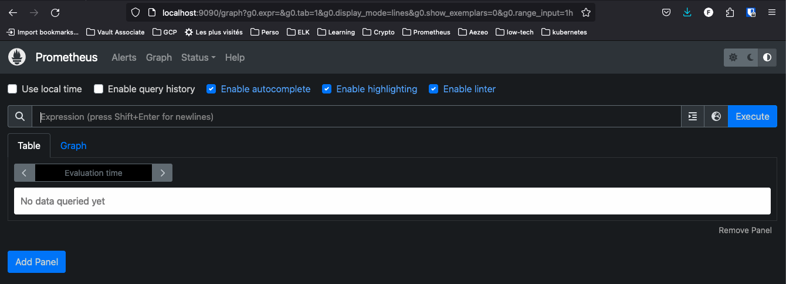
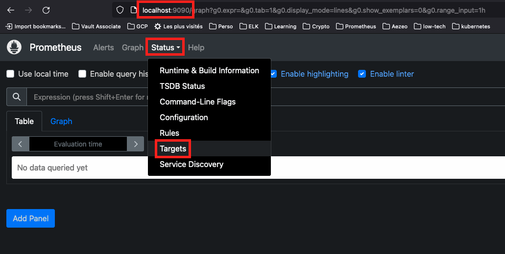
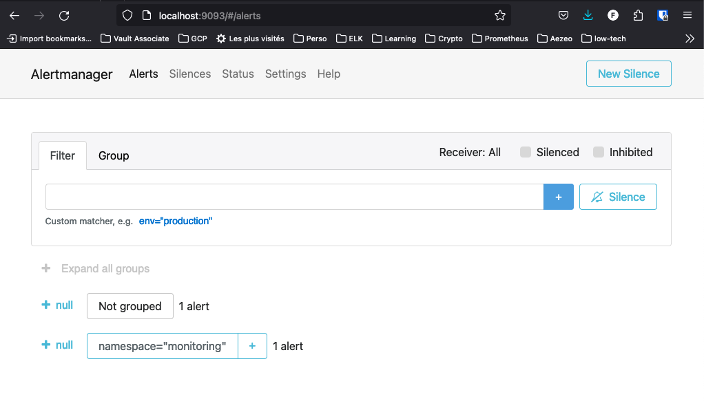

# 'kube-prometheus-stack' managed with FluxCD

----------------------------------------------------------------------------------------------------
## Abstract

Ce howto fait suite au hoxto _*'FluxCD / FluxCD - Démonstration par l'exemple'*_.

Il décrit comment déployer via FluxCD le Helm Chart 'kube-prometheus-stack' qui vise à installer un monitoring de notre cluster Kubernetes reposant sur Prometheus / Alert manager et Grafana.

|Doc|URL|
|---|---|
|artifacthub.io|https://artifacthub.io/packages/helm/prometheus-community/kube-prometheus-stack|
|GitHub|https://github.com/prometheus-community/helm-charts/tree/main/charts/kube-prometheus-stack|


----------------------------------------------------------------------------------------------------
## Préparatifs

Préparons notre environnement local :

```sh
# Répertoire accueillant nos dépôts Git en local
export LOCAL_GITHUB_REPOS="${HOME}/code/github"

# Mise à jour des copies locales des dépôts dédiés à FluxCD et aux applications qu'il gère
cd ${LOCAL_GITHUB_REPOS}/k8s-kind-apps   && git pull
cd ${LOCAL_GITHUB_REPOS}/k8s-kind-fluxcd && git pull

# Création d'un répertoire dédié au monitoring
mkdir -p ${LOCAL_GITHUB_REPOS}/k8s-kind-fluxcd/apps/monitoring
```

Créons ensuite un namesapce dédié au monitoring :

```sh
kubectl create ns monitoring --dry-run=client -o yaml > ${LOCAL_GITHUB_REPOS}/k8s-kind-fluxcd/apps/monitoring/namespace.yaml
kubectl apply -f ${LOCAL_GITHUB_REPOS}/k8s-kind-fluxcd/apps/monitoring/namespace.yaml
```


----------------------------------------------------------------------------------------------------
## Helm Repository

Nous pouvons désormais définir auprès de FluxCD le HelmRepository qui nous intéresse :

=== "code"
    ```sh
    flux create source helm prometheus-community \
      --url=https://prometheus-community.github.io/helm-charts \
      --namespace=monitoring \
      --interval=1m \
      --export > ${LOCAL_GITHUB_REPOS}/k8s-kind-fluxcd/apps/monitoring/helm-repository.yaml
    ```

=== "output"
    ```sh
    ---
    apiVersion: source.toolkit.fluxcd.io/v1beta2
    kind: HelmRepository
    metadata:
      name: prometheus-community
      namespace: monitoring
    spec:
      interval: 1m0s
      url: https://prometheus-community.github.io/helm-charts
    ```

Poussons nos modifications sur notre dépôt GitHub pour que FluxCD les prenne en compte :

=== "code"
    ```sh
    export LOCAL_GITHUB_REPOS="${HOME}/code/github"
    
    cd ${LOCAL_GITHUB_REPOS}/k8s-kind-fluxcd
    
    git add .
    git commit -m "feat: Defining a namespace + a Helm repository for Prometheus."
    git push
    
    flux reconcile kustomization flux-system --with-source
    
    kubectl -n monitoring get helmrepository
    ```

=== "output"
    ```sh
    NAME                   URL                                                  AGE   READY   STATUS
    prometheus-community   https://prometheus-community.github.io/helm-charts   37s   True    stored artifact: revision 'sha256:8d880a1010d4ba3df22364b59881e235590c184266f0c9fb894eeedb23442b12'
    ```


----------------------------------------------------------------------------------------------------
## Helm Release

Tentons l'installation de la stack de monitoring avec les valeurs par défaut (ie. sans devoir les surchager avec le flag _*'--values'*_) :

=== "code"
    ```sh
    export LOCAL_GITHUB_REPOS="${HOME}/code/github"

    flux create helmrelease kube-prometheus-stack \
      --source=HelmRepository/prometheus-community \
      --chart=kube-prometheus-stack \
      --namespace=monitoring \
      --export > ${LOCAL_GITHUB_REPOS}/k8s-kind-fluxcd/apps/monitoring/helm-release.yaml
    ```

=== "output"
    ```sh
    ---
    apiVersion: helm.toolkit.fluxcd.io/v2beta1
    kind: HelmRelease
    metadata:
      name: kube-prometheus-stack
      namespace: monitoring
    spec:
      chart:
        spec:
          chart: kube-prometheus-stack
          reconcileStrategy: ChartVersion
          sourceRef:
            kind: HelmRepository
            name: prometheus-community
      interval: 1m0s
    ```

Poussons nos modifications sur notre dépôt GitHub pour que FluxCD les prenne en compte :

=== "code"
    ```sh
    export LOCAL_GITHUB_REPOS="${HOME}/code/github"
    
    cd ${LOCAL_GITHUB_REPOS}/k8s-kind-fluxcd
    
    git add .
    git commit -m "feat: Defining a kube-prometheus-stack Helm release."
    git push
    
    flux reconcile kustomization flux-system --with-source
    
    kubectl -n monitoring get helmrelease
    ```

=== "output"
    ```sh
    NAME                    AGE   READY   STATUS
    kube-prometheus-stack   93s   True    Release reconciliation succeeded
    ```

Vérifions ce qui a été déployé sur le cluster :

=== "code"
    ```sh
    kubectl -n monitoring get all
    ```

=== "output"
    ```sh
    NAME                                                            READY   STATUS    RESTARTS   AGE
    pod/alertmanager-kube-prometheus-stack-alertmanager-0           2/2     Running   0          118s
    pod/kube-prometheus-stack-grafana-7cf5785ff8-qp5xf              3/3     Running   0          2m10s
    pod/kube-prometheus-stack-kube-state-metrics-65594f9476-8tpcv   1/1     Running   0          2m10s
    pod/kube-prometheus-stack-operator-6459f9c556-67dvk             1/1     Running   0          2m10s
    pod/kube-prometheus-stack-prometheus-node-exporter-qkjzz        1/1     Running   0          2m10s
    pod/prometheus-kube-prometheus-stack-prometheus-0               2/2     Running   0          118s
    
    NAME                                                     TYPE        CLUSTER-IP      EXTERNAL-IP   PORT(S)                      AGE
    service/alertmanager-operated                            ClusterIP   None            <none>        9093/TCP,9094/TCP,9094/UDP   118s
    service/kube-prometheus-stack-alertmanager               ClusterIP   10.96.133.65    <none>        9093/TCP,8080/TCP            2m10s
    service/kube-prometheus-stack-grafana                    ClusterIP   10.96.203.186   <none>        80/TCP                       2m10s
    service/kube-prometheus-stack-kube-state-metrics         ClusterIP   10.96.22.99     <none>        8080/TCP                     2m10s
    service/kube-prometheus-stack-operator                   ClusterIP   10.96.18.86     <none>        443/TCP                      2m10s
    service/kube-prometheus-stack-prometheus                 ClusterIP   10.96.60.161    <none>        9090/TCP,8080/TCP            2m10s
    service/kube-prometheus-stack-prometheus-node-exporter   ClusterIP   10.96.92.181    <none>        9100/TCP                     2m10s
    service/prometheus-operated                              ClusterIP   None            <none>        9090/TCP                     118s
    
    NAME                                                            DESIRED   CURRENT   READY   UP-TO-DATE   AVAILABLE   NODE SELECTOR            AGE
    daemonset.apps/kube-prometheus-stack-prometheus-node-exporter   1         1         1       1            1           kubernetes.io/os=linux   2m10s
    
    NAME                                                       READY   UP-TO-DATE   AVAILABLE   AGE
    deployment.apps/kube-prometheus-stack-grafana              1/1     1            1           2m10s
    deployment.apps/kube-prometheus-stack-kube-state-metrics   1/1     1            1           2m10s
    deployment.apps/kube-prometheus-stack-operator             1/1     1            1           2m10s
    
    NAME                                                                  DESIRED   CURRENT   READY   AGE
    replicaset.apps/kube-prometheus-stack-grafana-7cf5785ff8              1         1         1       2m10s
    replicaset.apps/kube-prometheus-stack-kube-state-metrics-65594f9476   1         1         1       2m10s
    replicaset.apps/kube-prometheus-stack-operator-6459f9c556             1         1         1       2m10s
    
    NAME                                                               READY   AGE
    statefulset.apps/alertmanager-kube-prometheus-stack-alertmanager   1/1     118s
    statefulset.apps/prometheus-kube-prometheus-stack-prometheus       1/1     118s
    ```


## Mise en place des alertes avec Discord

### Création d'un salon Discord

Nous n'allons pas réinventer la roue et réutiliserons le serveur Discord que nous avons provisionné préalablement et dont l'installation a été détaillée dans [ce howto](https://papafrancky.github.io/FluxCD/FluxCD_demonstration_par_l_exemple/#notifications-discord).

Nous suivrons également la procédure de création d'un salon de ce howto pour créer un salon privé dédié aux alertes liées à _*'kube-prometheus-stack'*_ que nous nommerons *'monitoring'* et pour lequel nous créerons un webhook.


### Création du secret correspondant au webhook

=== "code"
    ```sh
    export WEBHOOK_FOO="https://discord.com/api/webhooks/1242845059800633425/zyTYEpNZGf6vpd6C1sRLqeW_TGyFEMP2EM8BXAzockt20eeennkSHDKoO2-UxEG0K4ah"
    export LOCAL_GITHUB_REPOS="${HOME}/code/github"

    cd ${LOCAL_GITHUB_REPOS}/k8s-kind-fluxcd

    kubectl -n monitoring create secret generic discord-webhook --from-literal=address=${WEBHOOK_FOO} --dry-run=client -o yaml > apps/monitoring/discord-webhook.secret.yaml
    kubectl apply -f apps/monitoring/discord-webhook.secret.yaml
    ```

=== "output"
    ```sh
    apiVersion: v1
    data:
      address: aHR0cHM6Ly9kaXNjb3JkLmNvbS9hcGkvd2ViaG9va3MvMTI0Mjg0NTA1OTgwMDYzMzQyNS96eVRZRXBOWkdmNnZwZDZDMXNSTHFlV19UR3lGRU1QMkVNOEJYQXpvY2t0MjBlZWVubmtTSERLb08yLVV4RUcwSzRhaA==
    kind: Secret
    metadata:
      creationTimestamp: null
      name: discord-webhook
      namespace: monitoring
    ```

### Création du 'notification provider'

=== "code"
    ```sh
    export LOCAL_GITHUB_REPOS="${HOME}/code/github"

    cd ${LOCAL_GITHUB_REPOS}/k8s-kind-fluxcd

    flux create alert-provider discord \
      --type=discord \
      --secret-ref=discord-webhook \
      --channel=monitoring \
      --username=FluxCD \
      --namespace=monitoring \
      --export > apps/monitoring/notification-provider.yaml
    ```

=== "'monitoring' notification provider"
    ```sh
    ---
    apiVersion: notification.toolkit.fluxcd.io/v1beta2
    kind: Provider
    metadata:
      name: discord
      namespace: monitoring
    spec:
      channel: monitoring
      secretRef:
        name: discord-webhook
      type: discord
      username: FluxCD
    ```


### Configuration de l'alerte Discord dans FluxCD

=== "code"
    ```sh
    export LOCAL_GITHUB_REPOS="${HOME}/code/github"

    cd ${LOCAL_GITHUB_REPOS}/k8s-kind-fluxcd

    flux create alert discord \
      --event-severity=info \
      --event-source='GitRepository/*,Kustomization/*,ImageRepository/*,ImagePolicy/*,HelmRepository/*,HelmRelease/*' \
      --provider-ref=discord \
      --namespace=monitoring \
      --export > apps/monitoring/notification-alert.yaml
    ```

=== "output"
    ```sh
    ---
    apiVersion: notification.toolkit.fluxcd.io/v1beta2
    kind: Alert
    metadata:
      name: discord
      namespace: monitoring
    spec:
      eventSeverity: info
      eventSources:
      - kind: GitRepository
        name: '*'
      - kind: Kustomization
        name: '*'
      - kind: ImageRepository
        name: '*'
      - kind: ImagePolicy
        name: '*'
      - kind: HelmRepository
        name: '*'
      - kind: HelmRelease
        name: '*'
      providerRef:
        name: discord
    ```

#### Activation des alertes et notifications

##### Activation au niveau de FluxCD

Poussons nos modifications dans notre dépôt GitHub :

```sh
export LOCAL_GITHUB_REPOS="${HOME}/code/github"

cd ${LOCAL_GITHUB_REPOS}/k8s-kind-fluxcd

git add .
git commit -m "feat: setting up 'monitoring' Discord alerting."
git push

flux reconcile kustomization flux-system --with-source
```


##### Vérification de la création des alertes et notifications

=== "code"
    ```sh
    kubectl -n monitoring get providers,alerts
    ```

=== "output"
    ```sh
    NAME                                              AGE   READY   STATUS
    provider.notification.toolkit.fluxcd.io/discord   9s    True    Initialized

    NAME                                              AGE   READY   STATUS
    alert.notification.toolkit.fluxcd.io/discord      9s    True    Initialized
    ```


### Test de l'alerting

Nous allons supprimer la Helm Release et la réinstaller pour nous assurer que nous sommes bien notifiés dans le salon *'monitoring'* de Discord :

```sh
export LOCAL_GITHUB_REPOS="${HOME}/code/github"

cd ${LOCAL_GITHUB_REPOS}/k8s-kind-fluxcd


# suppression de la helm release :

mv apps/monitoring/helm-release.yaml apps/monitoring/helm-release.yaml.BKP

git add .
git commit -m 'test: removing the prometheus stack.' 
git push

flux reconcile kustomization flux-system --with-source


# ré-installation de la helm release :

mv apps/monitoring/helm-release.yaml.BKP apps/monitoring/helm-release.yaml

git add .
git commit -m 'test: re-installing the prometheus stack.' 
git push

flux reconcile kustomization flux-system --with-source
```

L'opération a bien généré une notification comme attendu :


!!! warning
    Discord nous a alerté du déploiement de la Helm Release mais pas de sa suppression.


## Accès à la stack de monitoring via le _*'port-forwarding'*_

### Activation du port-forwarding pour tous les composants

#### Détermination des composants de la stack de monitoring

=== "code"
    ```sh
    kubectl -n monitoring get services
    ```

=== "output"
    ```sh
    NAME                                             TYPE        CLUSTER-IP      EXTERNAL-IP   PORT(S)                      AGE
    alertmanager-operated                            ClusterIP   None            <none>        9093/TCP,9094/TCP,9094/UDP   12h
    kube-prometheus-stack-alertmanager               ClusterIP   10.96.61.95     <none>        9093/TCP,8080/TCP            12h
    kube-prometheus-stack-grafana                    ClusterIP   10.96.211.70    <none>        80/TCP                       12h
    kube-prometheus-stack-kube-state-metrics         ClusterIP   10.96.216.205   <none>        8080/TCP                     12h
    kube-prometheus-stack-operator                   ClusterIP   10.96.97.78     <none>        443/TCP                      12h
    kube-prometheus-stack-prometheus                 ClusterIP   10.96.20.214    <none>        9090/TCP,8080/TCP            12h
    kube-prometheus-stack-prometheus-node-exporter   ClusterIP   10.96.19.61     <none>        9100/TCP                     12h
    prometheus-operated                              ClusterIP   None            <none>        9090/TCP                     12h  
    ```
|Doc|URL|
|:---:|---|
|prometheus operator beginner's guide|https://blog.container-solutions.com/prometheus-operator-beginners-guide|

Je ne suis pas encore très familier avec cette stack, mais en lisant la doc dans le tableau précédent, je comprends qu'il faut privilégier _*'prometheus-operated'*_ et _*'alertmanager-operated'*_ pour accéder aux 2 services éponymes.


#### Port-forwarding de prometheus, alertmanager et grafana

```sh
kubectl -n monitoring port-forward service/prometheus-operated           9090:9090 &
kubectl -n monitoring port-forward service/alertmanager-operated         9093:9093 &
kubectl -n monitoring port-forward service/kube-prometheus-stack-grafana 8080:80   &
```


### Accès à Prometheus

!!! tip
    URL d'accès : **http://localhost:9090**

Assurons-nous que nous accédons bien à Prometheus à l'aide de notre navigateur :



Vérifions ensuite que toutes les _*'targets'*_ sont bien accessibles :



Elles apparaissent toutes en _*'healthy'*_ :


Si tel n'est pas le cas, reportez-vous au howto suivant pour patcher correctement votre cluster KinD : [https://papafrancky.github.io/000_setup/Kubernetes_en_local/](https://papafrancky.github.io/000_setup/Kubernetes_en_local/)


### Accès à Alertmanager

!!! tip
    URL d'accès : **http://localhost:9093**




### Accès à Grafana

!!! tip
    URL d'accès : **http://localhost:8080**


Grafana nécessite un compte (login, mot de passe) pour se connecter. Ce compte est stocké dans le namespace sous la forme d'un _*'secret'*_ : 

=== "code"
    ```sh
    # liste des secrets dans le namespace 'monitoring' :
    kubectl -n monitoring get secrets
    
    # détails du secret 'kube-prometheus-stack-grafana' :
    kubectl -n monitoring get secret kube-prometheus-stack-grafana -o yaml
    
    # récupération des secrets en base 64 :
    kubectl -n monitoring get secret kube-prometheus-stack-grafana -o json | jq -r '.data'
    
    # obtention du login admin :
    kubectl -n monitoring get secret kube-prometheus-stack-grafana -o jsonpath='{.data.admin-user}' | base64 -d
    
    # obtention du mot de passe admin :
    kubectl -n monitoring get secret kube-prometheus-stack-grafana -o jsonpath='{.data.admin-password}' | base64 -d
    ```

=== "secrets list"
    ```sh
    NAME                                                           TYPE                 DATA   AGE
    alertmanager-kube-prometheus-stack-alertmanager                Opaque               1      13h
    alertmanager-kube-prometheus-stack-alertmanager-generated      Opaque               1      13h
    alertmanager-kube-prometheus-stack-alertmanager-tls-assets-0   Opaque               0      13h
    alertmanager-kube-prometheus-stack-alertmanager-web-config     Opaque               1      13h
    discord-webhook                                                Opaque               1      13h
    kube-prometheus-stack-admission                                Opaque               3      16h
    kube-prometheus-stack-grafana                                  Opaque               3      13h
    prometheus-kube-prometheus-stack-prometheus                    Opaque               1      13h
    prometheus-kube-prometheus-stack-prometheus-tls-assets-0       Opaque               1      13h
    prometheus-kube-prometheus-stack-prometheus-web-config         Opaque               1      13h
    sh.helm.release.v1.kube-prometheus-stack.v1                    helm.sh/release.v1   1      13h  
    ```

=== "'kube-prometheus-stack-grafana' secret"
    ```sh
    apiVersion: v1
    data:
      admin-password: cHJvbS1vcGVyYXRvcg==
      admin-user: YWRtaW4=
      ldap-toml: ""
    kind: Secret
    metadata:
      annotations:
        meta.helm.sh/release-name: kube-prometheus-stack
        meta.helm.sh/release-namespace: monitoring
      creationTimestamp: "2024-05-24T20:35:45Z"
      labels:
        app.kubernetes.io/instance: kube-prometheus-stack
        app.kubernetes.io/managed-by: Helm
        app.kubernetes.io/name: grafana
        app.kubernetes.io/version: 10.4.1
        helm.sh/chart: grafana-7.3.11
        helm.toolkit.fluxcd.io/name: kube-prometheus-stack
        helm.toolkit.fluxcd.io/namespace: monitoring
      name: kube-prometheus-stack-grafana
      namespace: monitoring
      resourceVersion: "4610"
      uid: 69b6c201-f329-44d2-86dc-f588851b3d8f
    type: Opaque
    ```

=== "admin credentials, base64 hashed"
    ```sh
    {
      "admin-password": "cHJvbS1vcGVyYXRvcg==",
      "admin-user": "YWRtaW4=",
      "ldap-toml": ""
    }
    ```
=== "admin login"
    ```sh
    admin%
    ```

=== "admin password"
    ```sh
    prom-operator%
    ```

Nous pouvons désormais ouvrir une sessions :


Par défaut, la stack _*'kube-prometheus-stack'*_ propose un grand nombre de dashboards :


Nous ne passerons pas en revue tous les dashboards, mais voici 2 exemples de dashboards fournis par défaut avec la stack :

Kubernetes / Compute Resources / Cluster


Node Exporter / Nodes


----- TODO -----

* Se poser la question de protéger les secrets avec Vault
* une fois les secrets dans Vault, détruire le cluster et le re-créer avec les dépôts 'k8s-kind-fluxcd' et 'k8s-kind-apps' existants -> montrer l'avantage de FluxCD dans le cadre d'un PRA.
